# Product Requirements Document (PRD)

## AI-Based Smart Governance and Compliance Monitoring System for Coal Mines

|Field|Value|
|---|---|
|Document Type|Detailed Product Requirements Document (PRD)|
|Organization|Ministry of Coal|
|Department|Coal India Limited (CIL)|
|Category|Software|
|Theme|Smart Automation|
|Version|1.0|
|Status|Draft for Review|
|Prepared For|Smart India Hackathon / CIL Digital Transformation Initiative|

---

## Table of Contents

1. Executive Summary
2. Problem Statement
3. Goals & Objectives
4. Scope
5. Stakeholders & Personas
6. User Stories
7. Functional Requirements
8. Non-Functional Requirements
9. System Architecture (HLD)
10. Low-Level Design (LLD)
11. Technology Stack
12. Data Architecture & Database Design
13. AI/ML Architecture
14. Mobile Application Architecture
15. API Design
16. Security Architecture
17. DevOps, CI/CD & Infrastructure
18. Integration Architecture
19. Dashboards & Reporting
20. Workflow Automation & Alerts
21. Compliance & Audit Trail (Blockchain)
22. GIS Mapping & Geo-Tagging
23. OCR & Document Digitization
24. Multilingual Conversational Interface
25. Offline-First Strategy
26. Analytics & KPIs
27. Success Metrics
28. Risks & Mitigations
29. Assumptions & Constraints
30. Release Plan / Roadmap
31. Appendix

---

## 1. Executive Summary

The Indian coal mining sector, led by Coal India Limited (CIL) and its subsidiaries, operates across numerous mine sites, contractors, regulatory bodies, and field offices. Today, governance-critical activities — statutory compliance monitoring, inspection tracking, safety observations, production reporting, environmental monitoring, worker attendance, contractor management, grievance handling, and regulatory reporting — are managed through fragmented systems, manual documentation, spreadsheets, and delayed reporting.

This PRD defines a **centralized, AI-enabled Smart Governance and Compliance Monitoring Platform** ("SGCMP") that digitally unifies mine-level operations, statutory compliance, inspections, contractor management, and reporting into a single ecosystem — accessible via web dashboards and a geo-tagged, offline-capable mobile application — powered by AI/ML risk analytics, GIS mapping, OCR digitization, workflow automation, blockchain-backed audit trails, and multilingual conversational AI.

The platform is designed to be **scalable across all CIL subsidiaries** (ECL, BCCL, CCL, NCL, WCL, SECL, MCL, NEC, CMPDI) and mine sites, and extensible to other Ministry of Coal regulatory bodies (DGMS, MoEFCC, State Pollution Control Boards).

---

## 2. Problem Statement

### 2.1 Background

Coal mining governance activities are spread across multiple subsidiaries, mine sites, contractors, regulatory bodies, and field offices, and are currently managed through:

- Manual documentation and paper-based registers
- Disconnected spreadsheets per department/site
- Delayed, non-real-time reporting mechanisms
- Siloed systems with no single source of truth

### 2.2 Resulting Challenges

- Data inconsistency across sites and subsidiaries
- Delayed decision-making due to lack of real-time visibility
- Limited transparency for regulators and corporate management
- Compliance gaps and missed statutory deadlines
- Duplication of records across departments
- Weak monitoring of field-level activities (inspections, safety, environment)
- Difficulty obtaining real-time operational insights for leadership

### 2.3 Problem Definition

Develop a centralized AI-enabled governance and compliance monitoring platform for coal mining operations that digitally integrates mine-level activities, statutory compliance, inspections, contractor management, and operational reporting — improving transparency, accountability, and paperless digital governance at scale.

---

## 3. Goals & Objectives

### 3.1 Business Goals

- Improve governance efficiency and transparency in coal mining operations
- Reduce delays and errors in compliance management and reporting
- Enable data-driven monitoring and faster administrative decision-making
- Strengthen accountability and real-time tracking of field activities
- Support digital transformation and paperless governance in the mining sector
- Create a scalable, indigenous e-governance framework for Indian coal mines

### 3.2 Product Objectives (Solution Requirements — every point mapped)

| #   | Requirement (from problem statement)                                                                                                             | Addressed By                                      |
| --- | ------------------------------------------------------------------------------------------------------------------------------------------------ | ------------------------------------------------- |
| 1   | Digitally track statutory compliance (safety, environment, production, labour)                                                                   | Compliance Management Module                      |
| 2   | Real-time monitoring of inspections, observations, violations, corrective actions                                                                | Inspection & CAPA Module                          |
| 3   | AI/analytics to identify high-risk areas, recurring failures, anomalies                                                                          | AI/ML Risk Engine                                 |
| 4   | Geo-tagged, time-stamped field reporting via mobile app                                                                                          | Mobile App (React Native)                         |
| 5   | Dashboards for mine officials, corporate management, regulatory authorities                                                                      | Role-based Web Dashboards                         |
| 6   | Automated alerts, reminders, compliance reports, escalations                                                                                     | Workflow Automation Engine                        |
| 7   | Minimize manual paperwork, improve transparency & accountability                                                                                 | Digital Workflows + Audit Trail                   |
| 8   | Scalable across mines and subsidiaries                                                                                                           | Multi-tenant Microservices Architecture           |
| 9   | AI/ML, mobile apps, GIS mapping, OCR/document digitization, workflow automation, blockchain audit trails, multilingual conversational interfaces | All modules (detailed below)                      |
| 10  | Centralized dashboard for officials, management, regulators with real-time monitoring                                                            | Unified Governance Dashboard                      |
| 11  | AI/analytics engine for compliance risk, anomalies, recurring violations, predictive alerts                                                      | Predictive Risk & Anomaly Detection Service       |
| 12  | Geo-tagged mobile app for inspections, safety, attendance, incidents, with offline support                                                       | Offline-First Mobile App                          |
| 13  | Automated workflow for alerts, reminders, escalations, digital approvals, statutory reports                                                      | Workflow & Approval Engine                        |
| 14  | GIS mapping, OCR digitization, secure digital audit trails for paperless governance                                                              | GIS Service, OCR Service, Blockchain Audit Ledger |

---

## 4. Scope

### 4.1 In Scope

- Statutory Compliance Tracker (Safety, Environment, Production, Labour laws — Mines Act 1952, CMR 2017, MMR 1961, Environment Protection Act, Factories Act, etc.)
- Inspection & Safety Observation Management (DGMS-style inspections, near-miss reporting, violation tracking, Corrective and Preventive Action - CAPA)
- Contractor & Contract Lifecycle Management
- Production Reporting (shift-wise, mine-wise, subsidiary-wise)
- Environmental Monitoring (air/water quality, mine closure plans, afforestation tracking)
- Worker Attendance & Labour Compliance (biometric/geo-fenced attendance integration)
- Grievance Handling & Escalation Workflow
- Regulatory Reporting to DGMS, MoEFCC, State Pollution Control Boards, Ministry of Coal
- AI/ML Risk Scoring, Anomaly Detection, Predictive Alerts
- Geo-tagged Mobile Field App (Android/iOS) with offline sync
- Role-based Web Dashboards (Mine, Corporate, Regulator)
- OCR-based Document Digitization
- GIS Mapping of mine assets, hazard zones, inspection points
- Blockchain-anchored Audit Trail
- Multilingual Conversational Interface (Hindi, English, regional languages — chatbot/voice)
- Notification & Escalation Engine (SMS/Email/Push/WhatsApp)
- Admin & Master Data Management (mines, subsidiaries, users, roles, regulations)

### 4.2 Out of Scope (Phase 1)

- Heavy machinery IoT/telemetry integration (planned Phase 3)
- Financial/ERP payroll processing (integration only, not full ERP replacement)
- Autonomous drone flight control (drone imagery ingestion only, not flight operations)

---

## 5. Stakeholders & Personas

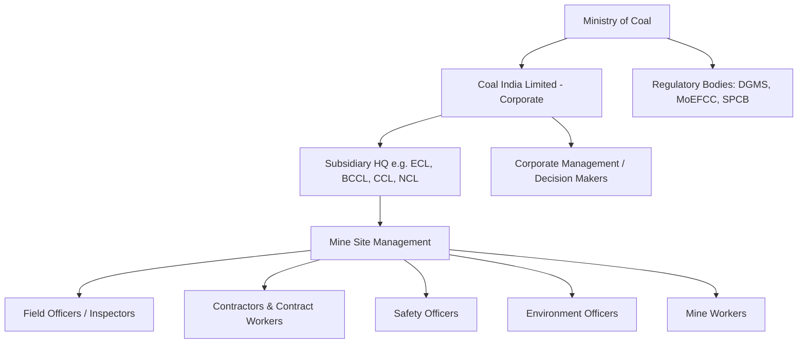

|Persona|Role|Key Needs|
|---|---|---|
|Field Inspector|Conducts on-site inspections, safety observations|Mobile app, offline capture, geo-tagging, quick violation logging|
|Mine Manager|Manages a single mine site|Real-time compliance status, alerts, task assignment|
|Safety Officer|Tracks safety incidents, near-misses, CAPA|Incident dashboard, root-cause analytics|
|Environment Officer|Monitors environmental compliance|Pollution readings, mine closure tracking|
|Contractor|Executes contracted work|Contract status, compliance obligations, document upload|
|Subsidiary Admin|Oversees multiple mines within a subsidiary|Subsidiary-wide dashboard, escalation management|
|Corporate Executive (CIL HQ)|Enterprise-wide oversight|Consolidated KPI dashboard, predictive risk heatmap|
|Regulator (DGMS/MoEFCC/SPCB)|External compliance oversight|Read-only regulator portal, statutory report access|
|System Admin|Platform configuration|User/role management, master data, regulation library|
|Worker (via kiosk/app)|Attendance, grievance submission|Simple multilingual UI, grievance status tracking|

---

## 6. User Stories (Representative Sample)

- As a **Field Inspector**, I want to log a geo-tagged, time-stamped safety observation with photos even when offline, so that data is captured accurately at the point of occurrence and synced later.
- As a **Mine Manager**, I want to see a real-time compliance dashboard for my mine, so that I can act on violations before statutory deadlines.
- As a **Safety Officer**, I want the AI engine to flag mines with recurring near-miss patterns, so that I can proactively intervene.
- As a **Corporate Executive**, I want a consolidated risk heatmap across all subsidiaries, so that I can prioritize resource allocation.
- As a **Regulator**, I want read-only access to statutory compliance reports for assigned mines, so that I can verify adherence without requesting manual reports.
- As a **Contractor**, I want to upload compliance documents via OCR-enabled scan, so that I don't need to manually re-key data.
- As a **System Admin**, I want to configure escalation rules per regulation type, so that overdue compliance items automatically escalate to the right authority.
- As a **Worker**, I want to submit a grievance in my regional language via chatbot, so that language is not a barrier to raising concerns.

---

## 7. Functional Requirements

### 7.1 Compliance Management Module

- FR-1.1: Maintain a master repository of applicable regulations (Mines Act, CMR, MMR, Environment Protection Act, Factories Act, Labour Codes)
- FR-1.2: Map each regulation to applicable mine type, subsidiary, and periodicity (daily/weekly/monthly/annual)
- FR-1.3: Auto-generate compliance task calendar per mine
- FR-1.4: Track compliance status (Pending / In Progress / Completed / Overdue / Escalated)
- FR-1.5: Attach supporting documents/evidence to each compliance item
- FR-1.6: Generate statutory compliance reports in prescribed regulatory formats (PDF/Excel)

### 7.2 Inspection & Safety Observation Module

- FR-2.1: Create inspection checklists (configurable per mine type/regulation)
- FR-2.2: Capture geo-tagged, time-stamped observations with photo/video evidence
- FR-2.3: Log violations with severity classification (Minor/Major/Critical)
- FR-2.4: Trigger CAPA (Corrective and Preventive Action) workflow on violation
- FR-2.5: Track CAPA closure with evidence and approval
- FR-2.6: Near-miss and incident reporting with root cause analysis

### 7.3 Contractor & Contract Management

- FR-3.1: Digital contractor onboarding with document verification (OCR)
- FR-3.2: Contract lifecycle tracking (issuance, renewal, expiry alerts)
- FR-3.3: Contractor compliance scorecard (safety record, statutory adherence)
- FR-3.4: Blacklist/flag management for non-compliant contractors

### 7.4 Production & Environmental Reporting

- FR-4.1: Shift-wise, mine-wise, subsidiary-wise production data capture
- FR-4.2: Environmental monitoring data ingestion (air/water quality sensors or manual entry)
- FR-4.3: Mine closure plan and afforestation progress tracking
- FR-4.4: Automated variance analysis vs. approved mining plan

### 7.5 Worker Attendance & Labour Compliance

- FR-5.1: Geo-fenced/biometric attendance capture integration
- FR-5.2: Labour law compliance tracking (working hours, safety equipment issuance)
- FR-5.3: Worker grievance submission and tracking

### 7.6 AI/Analytics Engine

- FR-6.1: Risk scoring model per mine site based on historical violations, inspection frequency, incident severity
- FR-6.2: Anomaly detection on production/environmental data (statistical + ML-based)
- FR-6.3: Predictive alerts for likely compliance breaches (time-series forecasting)
- FR-6.4: Recurring violation pattern clustering (identify systemic issues)
- FR-6.5: NLP-based auto-classification of grievances and observation text

### 7.7 Dashboards

- FR-7.1: Role-based dashboards (Mine / Subsidiary / Corporate / Regulator)
- FR-7.2: Real-time KPI widgets (compliance %, open violations, overdue tasks, risk heatmap)
- FR-7.3: Drill-down from subsidiary → mine → inspection record
- FR-7.4: Exportable reports (PDF/Excel/CSV)

### 7.8 Workflow Automation & Notifications

- FR-8.1: Configurable escalation matrix (role-based, time-based)
- FR-8.2: Multi-channel notifications — FCM push (standard), Notifee (emergency, DND bypass), Resend email (statutory/compliance)
- FR-8.3: Digital approval workflows (multi-level sign-off)
- FR-8.4: Automated statutory report generation and submission reminders

### 7.9 GIS Mapping

- FR-9.1: Interactive map of mine boundaries, hazard zones, inspection points
- FR-9.2: Geo-tagged incident/violation pin overlay
- FR-9.3: Heatmap layer for risk visualization

### 7.10 OCR & Document Digitization

- FR-10.1: Scan-to-digitize physical registers and compliance documents
- FR-10.2: Auto-extraction of key fields (dates, permit numbers, signatures) via OCR + AI
- FR-10.3: Document version control and archival

### 7.11 Blockchain Audit Trail

- FR-11.1: Immutable hash-anchored log of all compliance-critical transactions
- FR-11.2: Tamper-evidence verification for regulators
- FR-11.3: Audit trail export for legal/regulatory proceedings

### 7.12 Multilingual Conversational Interface

- FR-12.1: Chatbot supporting Hindi, English, and regional languages (Bengali, Odia, Telugu, etc.)
- FR-12.2: Voice-based query support for low-literacy users
- FR-12.3: Conversational grievance filing and compliance status queries

### 7.13 Admin & Master Data

- FR-13.1: User, role, and permission management (RBAC)
- FR-13.2: Mine/subsidiary hierarchy configuration
- FR-13.3: Regulation library management (versioned)

---

## 8. Non-Functional Requirements

|Category|Requirement|
|---|---|
|Scalability|Support 10,000+ concurrent users across 300+ mine sites; horizontally scalable microservices|
|Availability|99.9% uptime SLA for core services|
|Performance|API p95 response time < 300ms; dashboard load < 2s|
|Offline Support|Mobile app must support 72-hour offline operation with background sync|
|Security|ISO 27001-aligned; role-based access control; data encryption at rest & transit (AES-256/TLS 1.3)|
|Compliance|Aligned with MeitY GIGW guidelines, CERT-In empanelment, Data Protection (DPDP Act 2023)|
|Localization|Multilingual UI (minimum: Hindi, English + 4 regional languages)|
|Auditability|Every write operation logged with immutable audit trail|
|Interoperability|REST/GraphQL APIs; standard formats for regulator data exchange|
|Portability|Cloud-agnostic deployment (MeghRaj/NIC Cloud, AWS, Azure) via Kubernetes|
|Accessibility|WCAG 2.1 AA compliant web UI|
|Disaster Recovery|RPO ≤ 15 min, RTO ≤ 1 hour|

---

## 9. System Architecture (High-Level Design — HLD)

### 9.1 Architecture Style

A **cloud-native, event-driven microservices architecture** deployed on Kubernetes, following domain-driven design (DDD), with an API Gateway, service mesh, and a central event bus for asynchronous workflows (alerts, AI scoring, sync).

### 9.2 High-Level Architecture Diagram

```mermaid
graph TB
    subgraph Clients
        WEB[Web Dashboard - React + Vite + TS]
        MOB[Mobile App - React Native + Expo]
        BOT[Multilingual Chatbot/Voice IVR]
        REG[Regulator Portal]
    end

    subgraph Edge
        CDN[CDN / Static Hosting - Cloudflare]
        WAF[WAF + DDoS Protection]
        GW[API Gateway - Kong / NGINX]
    end

    subgraph AuthLayer[Identity & Access]
        IAM[Supabase Auth - GoTrue + RLS]
    end

    subgraph Services[Core Microservices - FastAPI]
        SVC_COMP[Compliance Service]
        SVC_INSP[Inspection Service]
        SVC_CONTRACT[Contractor Service]
        SVC_PROD[Production & Environment Service]
        SVC_ATT[Attendance & Labour Service]
        SVC_GRIEV[Grievance Service]
        SVC_NOTIF[Notification Service]
        SVC_GIS[GIS Service]
        SVC_OCR[OCR/Document Service]
        SVC_REPORT[Reporting Service]
    end

    subgraph AI[AI/ML Platform - Google ADK + Gemini]
        AI_RISK[RiskScoringAgent - gemini-1.5-pro]
        AI_ANOM[AnomalyDetectionAgent - gemini-2.0-flash]
        AI_NLP[WorkerChatbotAgent - gemini-2.0-flash]
        AI_VOICE[GrievanceAudioAgent - gemini-2.0-flash Audio]
        AI_REPORT[ReportDraftingAgent - gemini-1.5-pro]
    end

    subgraph Messaging[Event Backbone]
        KAFKA[Supabase Webhooks / Background Tasks]
    end

    subgraph Data[Data Layer]
        PG[(Supabase PostgreSQL + PostGIS)]
        REDIS[(Redis - Cache)]
        S3[(Supabase Storage - Media, Docs)]
        ES[(Elasticsearch - Search/Logs)]
    end

    subgraph ObservabilityStack[Observability]
        PROM[Prometheus + Grafana]
        ELK[ELK / OpenTelemetry]
        SENTRY[Sentry - Error Tracking]
    end

    WEB --> CDN --> WAF --> GW
    MOB --> GW
    BOT --> GW
    REG --> GW
    GW --> IAM
    GW --> SVC_COMP & SVC_INSP & SVC_CONTRACT & SVC_PROD & SVC_ATT & SVC_GRIEV & SVC_GIS & SVC_OCR & SVC_REPORT

    SVC_INSP --> KAFKA
    SVC_PROD --> KAFKA
    SVC_COMP --> KAFKA
    SVC_GRIEV --> KAFKA
    KAFKA --> AI_RISK & AI_ANOM & AI_VOICE
    KAFKA --> SVC_NOTIF

    AI_NLP --> BOT
    AI_RISK & AI_ANOM --> PG

    SVC_COMP --> PG
    SVC_INSP --> PG
    SVC_CONTRACT --> PG
    SVC_PROD --> PG
    SVC_ATT --> PG
    SVC_GRIEV --> PG
    SVC_OCR --> S3
    SVC_GIS --> PG
    SVC_REPORT --> ES

    Services -.-> REDIS
    Services -.-> PROM
    Services -.-> ELK
    Services -.-> SENTRY
```

### 9.3 Layered View

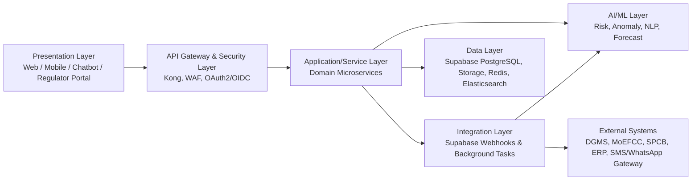

### 9.4 Deployment Topology

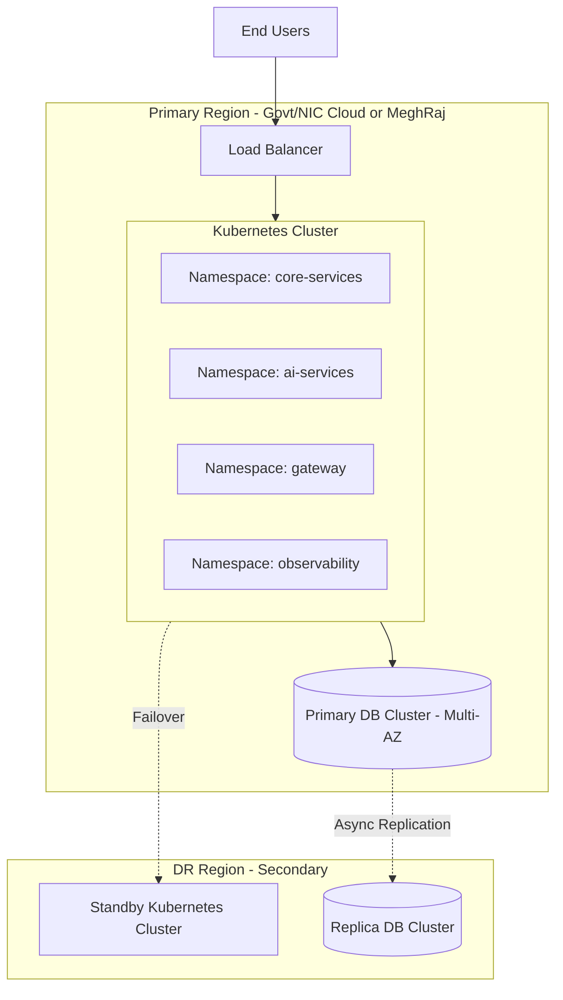

---

## 10. Low-Level Design (LLD)

### 10.1 Microservice Breakdown

| Service              | Responsibility                                     | Primary DB                    | Key APIs                                                        |
| -------------------- | -------------------------------------------------- | ----------------------------- | --------------------------------------------------------------- |
| Compliance Service   | Regulation mapping, task calendar, status tracking | Supabase PostgreSQL           | `/compliance/tasks`, `/compliance/status`, `/compliance/report` |
| Inspection Service   | Checklists, observations, violations, CAPA         | Supabase PostgreSQL           | `/inspections`, `/violations`, `/capa`                          |
| Contractor Service   | Contractor onboarding, contract lifecycle          | Supabase PostgreSQL           | `/contractors`, `/contracts`, `/scorecard`                      |
| Production Service   | Shift-wise production, environment readings        | Supabase PostgreSQL           | `/production`, `/environment/readings`                          |
| Attendance Service   | Worker attendance, labour compliance               | Supabase PostgreSQL           | `/attendance`, `/labour-compliance`                             |
| Grievance Service    | Grievance intake, tracking, resolution             | Supabase PostgreSQL           | `/grievances`, `/grievances/{id}/status`                        |
| Notification Service | Multi-channel notification dispatch                | Redis (queue)                 | `/notify`                                                       |
| GIS Service          | Spatial data, geo-fencing, heatmaps                | Supabase PostgreSQL (PostGIS) | `/gis/assets`, `/gis/heatmap`                                   |
| OCR Service          | Document scan, field extraction                    | Supabase Storage + PostgreSQL | `/ocr/extract`                                                  |
| AI Risk Engine       | Risk scoring per site                              | Supabase PostgreSQL           | `/ai/risk-score`                                                |
| Reporting Service    | Statutory/regulatory report generation             | Elasticsearch + PostgreSQL    | `/reports/generate`                                             |

### 10.2 Sequence Diagram — Field Inspection with Offline Sync

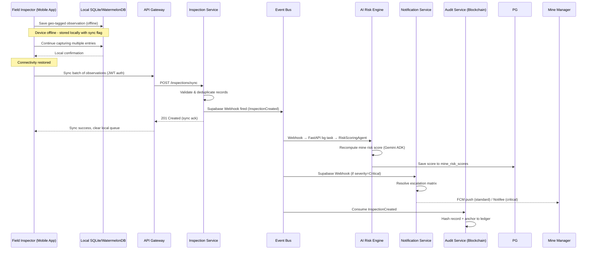

### 10.3 Sequence Diagram — Compliance Escalation Workflow

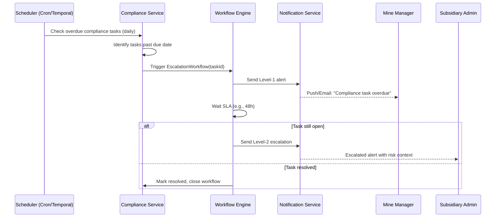

### 10.4 Entity Relationship (Core Domain)

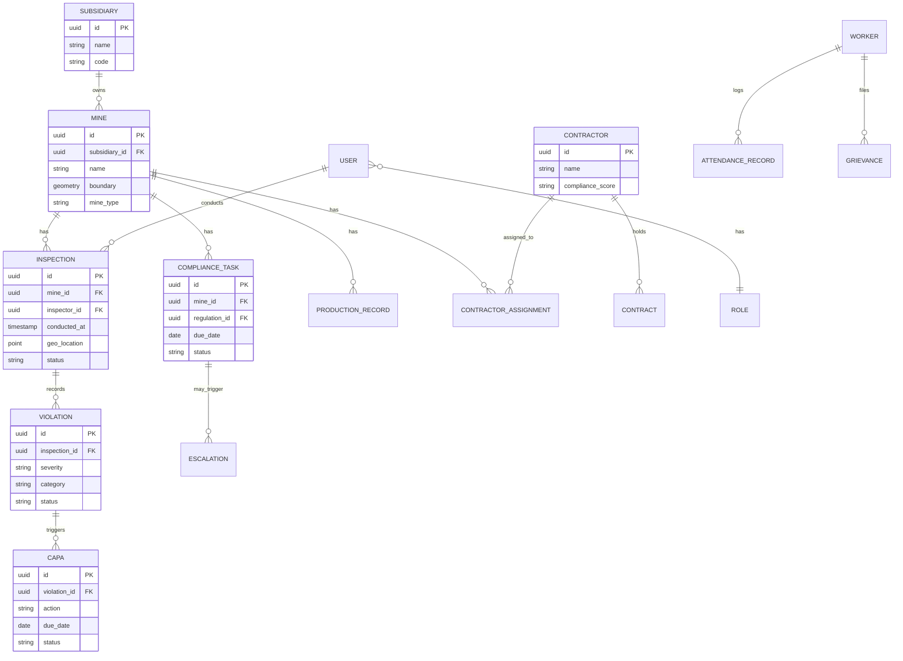

### 10.5 Class Diagram — Inspection Domain (Illustrative)

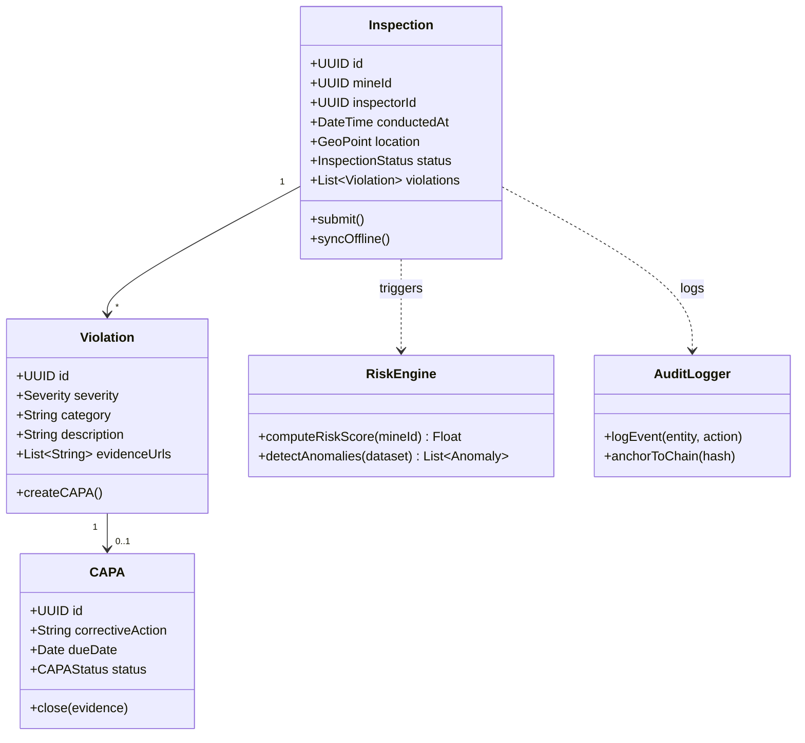

### 10.6 API Contract Example (Compliance Service)

```
POST /api/v1/compliance/tasks
{
  "mineId": "uuid",
  "regulationId": "uuid",
  "dueDate": "2026-09-30",
  "assignedTo": "uuid",
  "evidenceRequired": true
}

Response 201:
{
  "taskId": "uuid",
  "status": "PENDING",
  "createdAt": "2026-08-27T10:00:00Z"
}
```

```
GET /api/v1/compliance/tasks?mineId={id}&status=OVERDUE
Response 200:
{
  "count": 4,
  "tasks": [ { "taskId": "...", "regulation": "...", "dueDate": "...", "status": "OVERDUE" } ]
}
```

### 10.7 State Machine — Violation Lifecycle

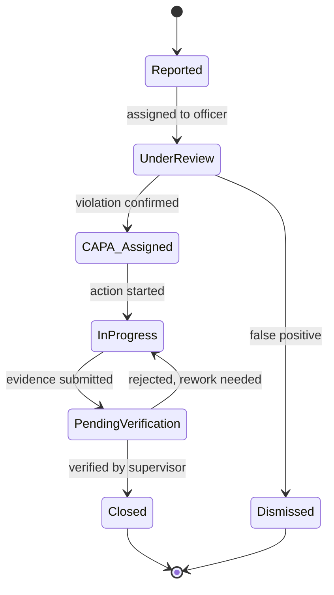

---

## 11. Technology Stack

### 11.1 Frontend (Web)

|Layer|Technology|
|---|---|
|Build Tool|**Vite**|
|Framework|**React 18/19**|
|Language|**TypeScript**|
|State Management|Redux Toolkit + RTK Query / TanStack Query|
|UI Library|Tailwind CSS + shadcn/ui + Radix UI|
|Forms & Validation|React Hook Form + Zod|
|Charts/Dashboards|Recharts, D3.js, Apache ECharts|
|Maps|Mapbox GL JS / Leaflet + PostGIS|
|Routing|React Router v7|
|Auth|Supabase Auth JS Client|
|Testing|Vitest, React Testing Library, Playwright (E2E)|
|Micro-frontend (optional, for scale)|Module Federation (Vite plugin)|

### 11.2 Mobile Application

|Layer|Technology|
|---|---|
|Framework|**React Native** (Expo Bare workflow, SDK 56)|
|Language|TypeScript|
|Navigation|**Expo Router** (file-based routing)|
|Offline Storage|WatermelonDB (SQLite-backed reactive local DB)|
|State Management|Zustand v4|
|Geo/Maps|react-native-maps, expo-location|
|Camera|react-native-vision-camera|
|Voice Input|**Gemini Audio API** (multilingual: Hindi, Bengali, Odia, Marathi, English)|
|Background Sync|expo-background-task|
|Standard Push|expo-notifications + FCM|
|Emergency Alarms|**Notifee** (DND bypass, full-screen intent, custom siren)|
|Biometric|expo-local-authentication|
|Secure Storage|expo-secure-store (Keychain/Keystore)|

### 11.3 Backend

| **Layer** | **Technology** | **Purpose** |
| -------------------------------- | -------------------------------------------------------- | --------------------------------------------------------------------------------------------------------- |
| **API Framework** | **FastAPI** (with **Pydantic v2**) | Native async, auto OpenAPI 3.1, high throughput |
| **ASGI Server** | **Uvicorn** (with `uvloop`) | Production-grade async HTTP server |
| **ORM & Spatial** | **SQLAlchemy 2.0 (Async)** + **GeoAlchemy2** + asyncpg | Full async ORM, native PostGIS geometry |
| **Background Jobs** | **FastAPI Background Tasks** | Escalation ladders, SLA timers, PDF generation (replaces Kafka/Temporal) |
| **Event Bus** | **Supabase Webhooks** (Postgres triggers → FastAPI HTTP) | Async event delivery on DB mutations |
| **AI / Agents** | **Google ADK + Gemini API** | All AI intelligence — no separate ML training pipeline |
| **OCR Engine** | **Tesseract 5** | Offline-capable legacy document digitization |
| **PDF Generation** | **WeasyPrint + Jinja2** | Pure Python statutory document rendering |
| **Search** | OpenSearch | Full-text search on grievances & inspection narratives |
| **Cache** | Redis 7 | Corporate dashboard rollup cache |
| **Scheduled Jobs** | **pg_cron** (Supabase PostgreSQL) | Risk score recomputation, compliance escalation, report generation |

### 11.4 Databases & Storage

|Purpose|Technology|
|---|---|
|Transactional/Relational|Supabase PostgreSQL 15+ (with PostGIS extension for GIS)|
|Document/Flexible Schema|Supabase PostgreSQL (JSONB columns)|
|Time-Series (env/production sensors)|Supabase PostgreSQL|
|Object Storage (media, docs)|Supabase Storage|
|Cache/Session|Redis|
|Search & Logs|Elasticsearch|

### 11.5 AI / Agents Stack

|Purpose|Technology|
|---|---|
|**AI Agent Framework**|**Google ADK (Agent Development Kit)**|
|**AI Model (complex tasks)**|**Gemini 1.5 Pro** — mine risk scoring, statutory report narrative drafting|
|**AI Model (fast tasks)**|**Gemini 2.0 Flash** — anomaly detection, incident classification, chatbot|
|**AI Model (voice/audio)**|**Gemini 2.0 Flash Audio API** — multilingual voice grievance processing|
|**Regulation Retrieval**|ADK FunctionTool querying `regulations` PostgreSQL table (replaces pgvector/RAG)|
|**OCR Engine**|**Tesseract 5** (offline-capable; no cloud dependency for document digitization)|
|**Agent Implementations**|RiskScoringAgent, AnomalyDetectionAgent, ReportDraftingAgent, GrievanceAudioAgent, WorkerChatbotAgent|

> **What this replaces from earlier drafts:**
> - ~~scikit-learn / XGBoost / LightGBM~~ → Gemini RiskScoringAgent
> - ~~Facebook Prophet / statsmodels~~ → Gemini AnomalyDetectionAgent
> - ~~Claude API / Llama~~ → Gemini ReportDraftingAgent
> - ~~Bhashini STT / Whisper~~ → Gemini Audio API
> - ~~pgvector / Weaviate~~ → ADK FunctionTool over `regulations` table
> - ~~MLflow / Kubeflow / Triton / BentoML~~ → Not required (no local model training/serving)

### 11.6 DevOps & Infrastructure

|Purpose|Technology|
|---|---|
|Containerization|Docker|
|Orchestration|Kubernetes (K8s)|
|IaC|Terraform + Helm Charts|
|CI/CD|GitHub Actions / GitLab CI + ArgoCD (GitOps)|
|Cloud|NIC Cloud / MeghRaj (Govt Cloud) primary; AWS/Azure as DR option|
|Container Registry|Harbor|
|Observability|Prometheus + Grafana, OpenTelemetry, Loki|
|Error Tracking|Sentry|
|API Documentation|Swagger/OpenAPI 3.1, Redoc|
|Secrets Management|HashiCorp Vault|
|Load Testing|k6|

### 11.7 Security Tooling

|Purpose|Technology|
|---|---|
|WAF/DDoS|Cloudflare / AWS Shield|
|SAST/DAST|SonarQube, OWASP ZAP|
|Dependency Scanning|Snyk / Trivy|
|Secrets Scanning|GitLeaks|
|Compliance|ISO 27001, CERT-In audit readiness|

---

## 12. Data Architecture & Database Design

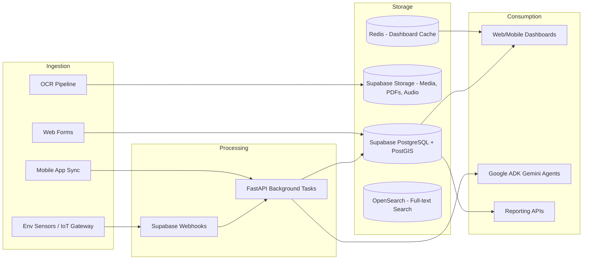

- **Multi-tenancy model:** Schema-per-subsidiary or row-level security (RLS) in PostgreSQL keyed by `subsidiary_id`/`mine_id`, enforced at the API Gateway and DB layer.
- **Data retention:** Compliance/audit data retained per statutory record-keeping norms (minimum 7 years); media evidence archived to cold storage after 1 year.
- **Backup:** Automated daily snapshots, cross-region replication, quarterly DR drills.

---

## 13. AI Architecture (Google ADK + Gemini)

All AI intelligence is powered exclusively by **Google Agent Development Kit (ADK)** with **Gemini API** models. Agents use `FunctionTool` to call Supabase PostgreSQL, reason over live data, and return structured outputs. No separate ML training pipeline or model registry is needed.

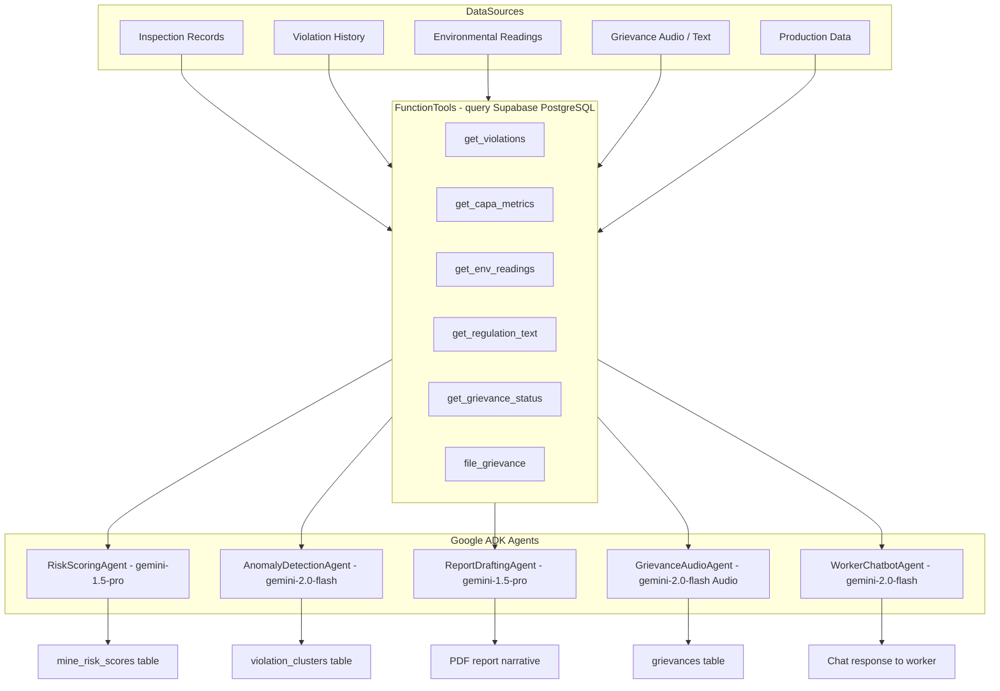

### 13.1 Agent Responsibilities

1. **RiskScoringAgent** (`gemini-1.5-pro`): Every 6 hours per mine + event-driven. Calls tools to gather violations, CAPAs, env breaches, production pressure, contractor compliance, incident history. Returns `score (0–100)`, `risk_level`, `trend`, `contributing_factors`, `recommendations`.

2. **AnomalyDetectionAgent** (`gemini-2.0-flash`): Weekly per mine. Analyses 18 months of violations. Flags recurring zone+statute clusters (≥3 occurrences = cluster; ≥5 = systemic risk).

3. **ReportDraftingAgent** (`gemini-1.5-pro`): Called during statutory report generation. Fetches data via tools and writes formal narrative sections citing exact regulation text.

4. **GrievanceAudioAgent** (`gemini-2.0-flash` Audio API): Triggered when worker syncs audio. Transcribes + translates + classifies (category, priority, summary) in Hindi, Bengali, Odia, Marathi, or English.

5. **WorkerChatbotAgent** (`gemini-2.0-flash`): Always-on chatbot for workers. Responds in the worker's language. Can file grievances, check status, and check attendance via tool calls.

---

## 14. Mobile Application Architecture

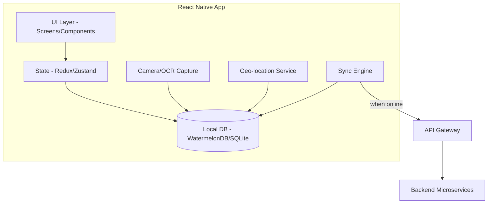

### 14.1 Offline-First Sync Strategy

- **Local-first writes:** All field data written to local SQLite/WatermelonDB first, marked `pending_sync`.
- **Conflict resolution:** Last-write-wins with server-side timestamp arbitration; critical fields (violations) use append-only merge (no overwrite).
- **Sync trigger:** Background sync on connectivity restore + periodic foreground sync + manual "Sync Now."
- **Media handling:** Photos/videos compressed and queued for chunked upload to object storage; low-bandwidth adaptive quality.
- **Idempotency:** Client-generated UUIDs prevent duplicate records on retry.

---

## 15. API Design

### 15.1 API Principles

- RESTful resource-oriented design; GraphQL federation layer for dashboard aggregation queries
- Versioned APIs (`/api/v1/...`)
- OpenAPI 3.1 spec-first development
- Consistent error envelope: `{ "error": { "code", "message", "details" } }`
- Pagination via cursor-based approach for large datasets
- Idempotency keys for write operations from mobile sync

### 15.2 Sample API Inventory

|Method|Endpoint|Description|
|---|---|---|
|POST|`/api/v1/inspections`|Create inspection record|
|POST|`/api/v1/inspections/sync`|Batch sync offline records|
|GET|`/api/v1/dashboard/risk-heatmap`|Risk heatmap data per region|
|POST|`/api/v1/ocr/extract`|Extract fields from scanned document|
|GET|`/api/v1/compliance/tasks`|List compliance tasks with filters|
|POST|`/api/v1/grievances`|File a grievance|
|GET|`/api/v1/audit/verify/{recordId}`|Verify record against blockchain hash|
|POST|`/api/v1/chatbot/query`|Multilingual conversational query|

---

## 16. Security Architecture

```mermaid
graph TB
    U[User] --> WAF[WAF / DDoS Protection]
    WAF --> GW[API Gateway]
    GW --> IAM[Supabase Auth - GoTrue/MFA]
    IAM --> RBAC[Role-Based Access Control Engine]
    RBAC --> SVC[Microservices]
    SVC --> VAULT[HashiCorp Vault - Secrets/Keys]
    SVC --> ENC[Encryption at Rest - AES-256]
    SVC -.TLS 1.3.-> DB[(Databases)]
    SVC --> AUDIT[Immutable Audit Log]
```

- **Authentication:** Supabase Auth (GoTrue); MFA mandatory for corporate/regulator roles.
- **Authorization:** Fine-grained RBAC + Attribute-Based Access Control (mine-level, subsidiary-level scoping).
- **Data Protection:** AES-256 encryption at rest, TLS 1.3 in transit, field-level encryption for sensitive worker PII.
- **Compliance:** Aligned with DPDP Act 2023, MeitY GIGW, CERT-In empanelled security audit before go-live.
- **Audit Logging:** Every create/update/delete on compliance-critical entities logged and hash-anchored to the blockchain ledger (tamper-evidence).
- **Penetration Testing:** Mandatory before each major release; VAPT via CERT-In empanelled auditor.

---

## 17. DevOps, CI/CD & Infrastructure

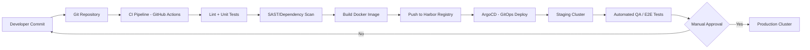

- **Environments:** Dev → QA → Staging → Production, each isolated K8s namespace/cluster.
- **GitOps:** ArgoCD syncs cluster state from Git-declared manifests (Helm charts).
- **Blue-Green / Canary Deployments** for zero-downtime releases.
- **Autoscaling:** Horizontal Pod Autoscaler (HPA) based on CPU/memory/custom Kafka lag metrics.
- **Infrastructure as Code:** Terraform modules per environment; reproducible provisioning.

---

## 18. Integration Architecture

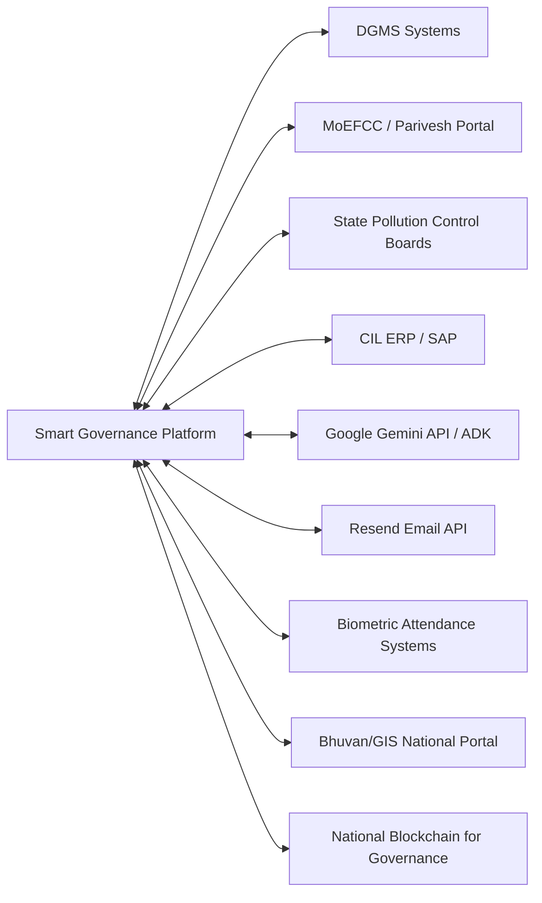

- Integration via secure REST/SOAP adapters and message queues; each external integration isolated behind an **Anti-Corruption Layer (ACL)** microservice to shield core domain from external schema changes.

---

## 19. Dashboards & Reporting

|Dashboard|Audience|Key Widgets|
|---|---|---|
|Mine Operations Dashboard|Mine Manager, Safety Officer|Open violations, CAPA status, today's inspections, attendance snapshot|
|Subsidiary Dashboard|Subsidiary Admin|Mine-wise compliance %, escalation queue, contractor scorecards|
|Corporate Command Center|CIL Executives|Enterprise risk heatmap, predictive alerts, KPI trends, regulatory submission status|
|Regulator Portal|DGMS/MoEFCC/SPCB|Read-only statutory reports, verified audit trail, mine compliance certificates|
|AI Insights Panel|All (role-scoped)|Risk score trends, anomaly flags, recurring violation clusters|

---

## 20. Workflow Automation & Alerts

- **Escalation Matrix Engine:** Configurable rules (e.g., overdue > 48h → Mine Manager; > 96h → Subsidiary Admin; > 7 days → Corporate + Regulator visibility). Implemented via `pg_cron` + FastAPI background tasks.
- **Multi-channel notification:** Standard alerts via FCM push + Resend email. Emergency alarms (CH4 breach, fatal incident) via Notifee (DND bypass, custom siren, full-screen intent).
- **Digital Approvals:** Multi-level sign-off workflows for CAPA closure, contract approval, statutory report submission (FastAPI background tasks + Supabase Realtime status updates).
- **Automated Report Generation:** `pg_cron` scheduled jobs generate statutory reports (DGMS returns, environmental compliance reports) in prescribed formats; Gemini ReportDraftingAgent populates narrative sections; WeasyPrint renders PDF.

---

## 21. Compliance & Audit Trail (Blockchain)

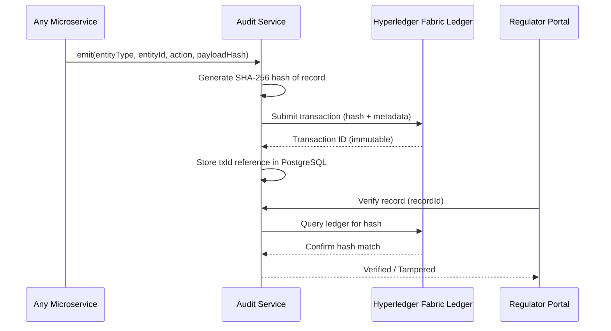

- **Consortium members (permissioned blockchain):** CIL, DGMS, MoEFCC, State Pollution Control Boards — each operates a peer node for shared trust without exposing raw operational data (only hashes/metadata anchored).
- Full record data stays in CIL's PostgreSQL/MongoDB; only cryptographic hashes are anchored on-chain, ensuring tamper-evidence without data duplication overhead.

---

## 22. GIS Mapping & Geo-Tagging

- Mine boundaries, hazard zones, and inspection points stored as PostGIS geometries.
- Mobile app captures `lat/long` + accuracy radius with every field entry (geo-fencing validates entries are within registered mine boundary — flags off-site entries for review).
- Web dashboard renders interactive layers: mine boundary, active hazard zones, violation density heatmap, contractor work-zone overlays (Mapbox GL / Leaflet).
- Integration with **Bhuvan** (ISRO's national geo-portal) for satellite imagery overlay to detect unauthorized mining extension (change detection via periodic satellite image comparison).

---

## 23. OCR & Document Digitization

```mermaid
graph LR
    SCAN[Scan/Photo of Document] --> PREPROC[Image Pre-processing - deskew, denoise]
    PREPROC --> OCR[OCR Engine - Tesseract 5 (offline-capable)]
    OCR --> NER[AI Field Extraction - NER Model]
    NER --> VALIDATE[Validation UI - human-in-the-loop]
    VALIDATE --> STORE[(Store structured data + original scan)]
```

- Supports digitizing legacy paper registers (safety logs, statutory permits, contractor licenses).
- Human-in-the-loop validation step for low-confidence extractions before committing to the system of record.
- Extracted structured data auto-populates compliance/contractor records, reducing manual re-keying.

---

## 24. Multilingual Conversational Interface

- **Channels:** In-app chatbot (web dashboard + mobile Tab 5), voice note filing (mobile).
- **Languages natively supported:** Hindi (hi), English (en), Bengali (bn), Odia (or), Marathi (mr).
- **AI Engine:** **Google Gemini API** exclusively — both text and audio modalities.
- **Capabilities:**
    - Compliance status queries in any supported language via WorkerChatbotAgent
    - Grievance filing via natural text conversation (WorkerChatbotAgent → `file_grievance` tool)
    - Voice grievance filing: worker records audio → offline-queued → Gemini Audio API processes on sync (transcription + translation + classification)
    - Regulation queries: WorkerChatbotAgent calls `get_regulation_text` FunctionTool → cites CMR 2017 / EC conditions directly
- **Architecture:** Worker speaks/types → Gemini Audio API (voice) or Gemini 2.0 Flash (text) → WorkerChatbotAgent with FunctionTools → structured response in worker's language. No separate STT/TTS pipeline needed.

---

## 25. -First Strategy

|Aspect|Approach|
|---|---|
|Local storage|WatermelonDB (reactive, sync-friendly ORM over SQLite)|
|Sync protocol|Custom delta-sync: pull changes since `last_synced_at`, push local pending queue|
|Conflict handling|Append-only for evidence records; last-write-wins with audit trail for status fields|
|Media|Deferred, chunked, resumable uploads (tus protocol)|
|Battery/data optimization|Adaptive sync frequency based on connectivity type (WiFi vs. cellular)|

---

## 26. Analytics & KPIs

- Statutory Compliance % (mine-wise, subsidiary-wise, enterprise-wide)
- Average time-to-closure for CAPA
- Number of open vs. closed violations (trend over time)
- Inspection coverage rate (planned vs. actual inspections)
- Predictive risk score distribution across mines
- Escalation SLA adherence rate
- Grievance resolution turnaround time
- Contractor compliance scorecard trends
- Paperless adoption rate (digital vs. manual submissions)

---

## 27. Success Metrics

|Metric|Target (Year 1 post rollout)|
|---|---|
|Reduction in compliance reporting delays|≥ 60%|
|Reduction in manual paperwork|≥ 70%|
|Increase in inspection coverage|≥ 40%|
|Mean time to detect high-risk mine sites|< 24 hours (via AI risk engine)|
|Regulator report generation time|From weeks → real-time/on-demand|
|Mobile app adoption among field staff|≥ 85%|
|System uptime|≥ 99.9%|
|Audit trail tamper-evidence verification|100% of critical records anchored|

---

## 28. Risks & Mitigations

|Risk|Impact|Mitigation|
|---|---|---|
|Poor network connectivity at remote mine sites|Data loss/delay|Offline-first mobile architecture with robust local-first sync|
|Resistance to digital adoption by field staff|Low usage|Multilingual voice interface, simplified UI, training programs|
|Data privacy concerns (worker PII)|Regulatory non-compliance|DPDP Act-aligned data handling, field-level encryption, consent management|
|Integration complexity with legacy regulator systems|Delayed rollout|Anti-Corruption Layer adapters, phased integration|
|AI model bias/inaccuracy in risk scoring|Wrong prioritization|Human-in-the-loop review, continuous model monitoring (Evidently AI)|
|Blockchain consortium governance across agencies|Slow onboarding|Start with CIL-only ledger, phase in DGMS/MoEFCC nodes|
|Scalability across 300+ mine sites|Performance degradation|Horizontally scalable microservices, load testing (k6), autoscaling|

---

## 29. Assumptions & Constraints

- Field mine sites have intermittent connectivity; smartphones (Android-majority) are the primary field device.
- Government cloud (MeghRaj/NIC) is the preferred hosting environment; architecture remains cloud-agnostic for portability.
- Regulatory bodies (DGMS, MoEFCC, SPCB) will provide API/data exchange specifications during integration phase.
- Existing legacy data (paper registers) will be digitized progressively via OCR, not a one-time bulk migration.
- Multilingual voice/text input handled natively via Google Gemini API (no dependency on Bhashini or external STT services).

---

## 30. Release Plan / Roadmap

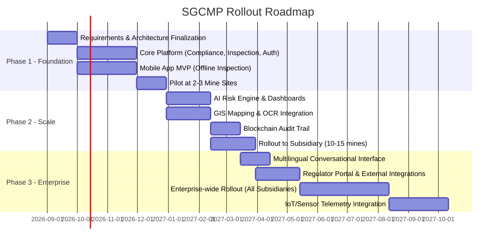

---

## 31. Appendix

### 31.1 Glossary

- **CAPA:** Corrective and Preventive Action
- **DGMS:** Directorate General of Mines Safety
- **MoEFCC:** Ministry of Environment, Forest and Climate Change
- **SPCB:** State Pollution Control Board
- **RAG:** Retrieval-Augmented Generation
- **RBAC:** Role-Based Access Control
- **SLA:** Service Level Agreement
- **DPDP Act:** Digital Personal Data Protection Act, 2023

### 31.2 Regulatory Frameworks Referenced

- Mines Act, 1952
- Coal Mines Regulations (CMR), 2017
- Metalliferous Mines Regulations (MMR), 1961
- Environment (Protection) Act, 1986
- Factories Act, 1948
- Relevant Labour Codes

### 31.3 Document Revision History

|Version|Date|Change|
|---|---|---|
|1.0|2026-08-27|Initial comprehensive PRD draft|