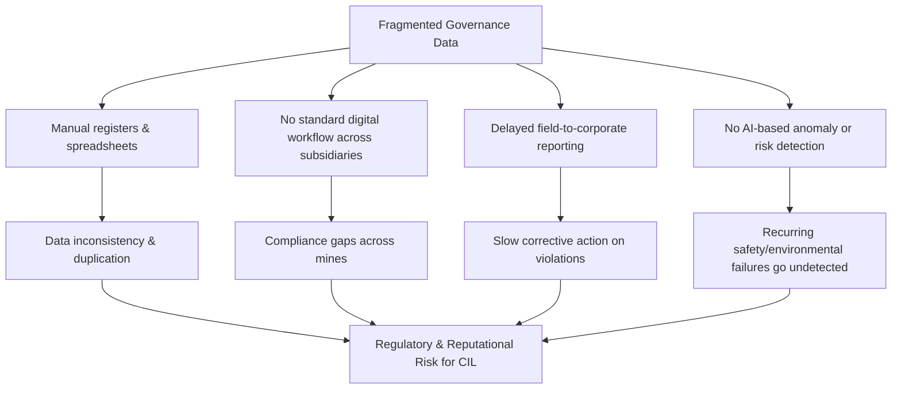
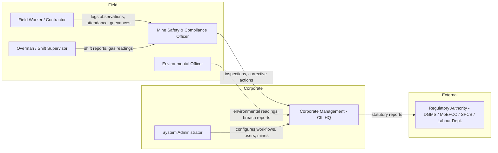
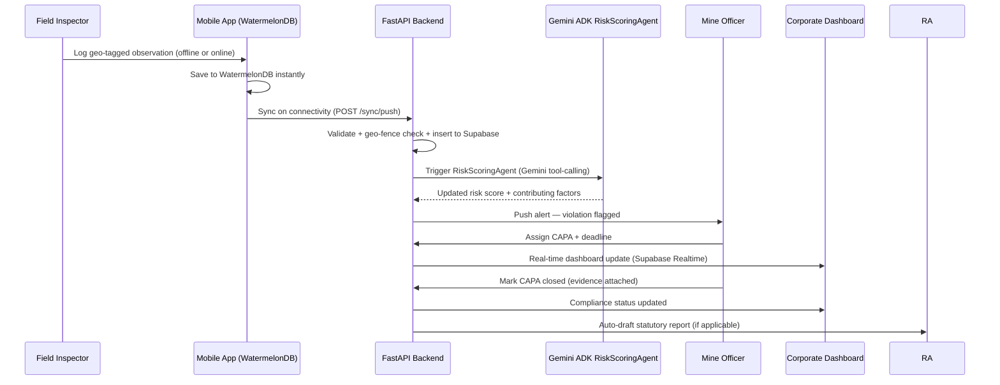
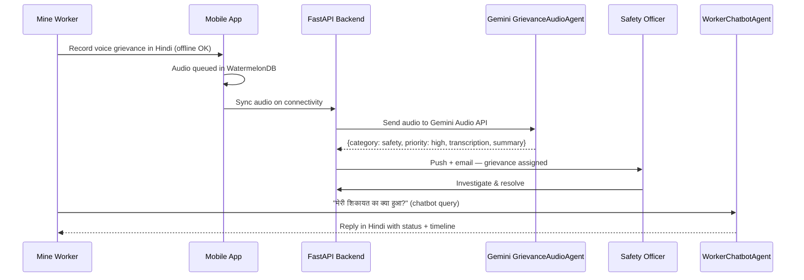
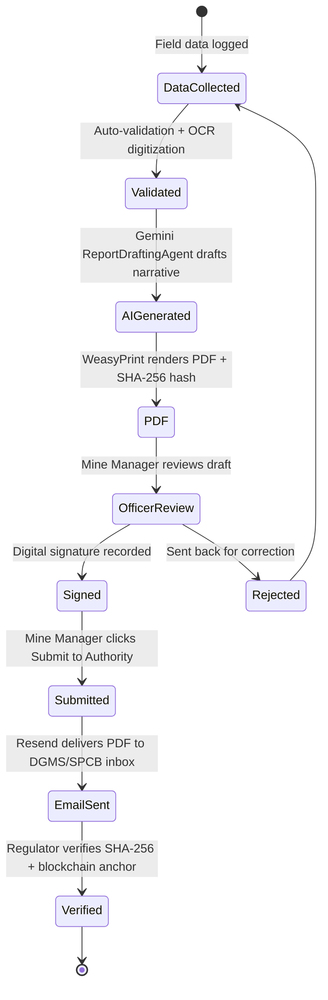
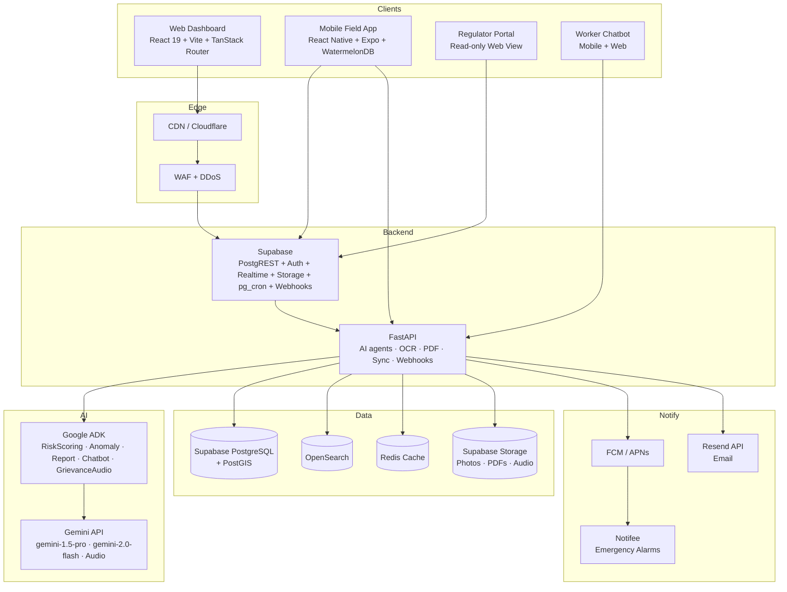
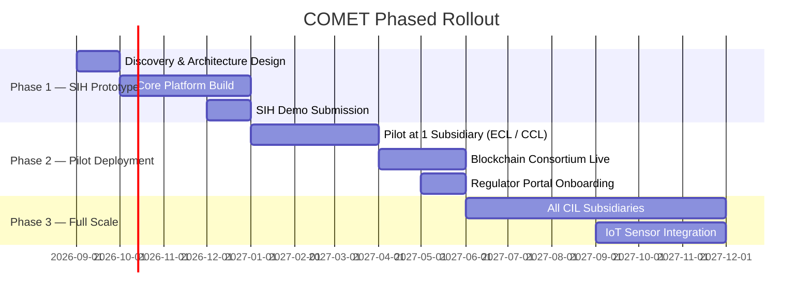

# Product Brief: COMET — AI-Based Smart Governance & Compliance Monitoring System for Coal Mines

|---|---|
|**Sponsor Organization**|Ministry of Coal|
|**Owning Department**|Coal India Limited (CIL)|
|**Category**|Software|
|**Theme**|Smart Automation|
|**Problem Statement ID**|SIH 2026 — 26024|
|**Platform Name**|COMET (Coal Operations Monitoring, Enforcement & Transparency)|
|**Document Owner**|Product Management|
|**Status**|Draft v2.0|
|**Last Updated**|September 2026|

---

## 1. Executive Summary

Coal India Limited operates through multiple subsidiaries, mine sites, contractors, and regulatory touchpoints. Today, governance activities — statutory compliance, inspections, safety observations, production reporting, environmental monitoring, worker attendance, contractor management, and grievance handling — run on **fragmented spreadsheets, manual registers, and delayed paper trails**.

COMET is a **centralized, AI-enabled Smart Governance and Compliance Monitoring Platform** that unifies these workflows into one digital ecosystem, spanning:
- Role-based web dashboards for mine officials, corporate management, and regulators
- A geo-tagged, offline-capable mobile field app for inspectors, overmen, and field officers
- A Google Gemini + ADK powered AI layer for risk scoring, anomaly detection, predictive alerts, and statutory report generation
- Multilingual voice/text interfaces for low-literacy field workers and regional language speakers

This brief defines **what problem we are solving, for whom, and what "done" looks like**.

---

## 2. Problem Statement

> Mine-level governance data across CIL's subsidiaries is fragmented, manually recorded, and reported with delay — creating compliance blind spots, weak field accountability, and slow, low-visibility decision-making at corporate and regulatory levels.

### 2.1 Root Causes

### 2.2 Who Feels This Pain

| Stakeholder | Pain Today |
|---|---|
| Mine Safety/Compliance Officer | Manually logs inspections, chases paperwork, no real-time visibility into violations |
| Corporate Management (CIL HQ) | No consolidated real-time view across subsidiaries; relies on periodic manual roll-ups |
| Regulatory Authorities (DGMS, MoEFCC, Labour Dept.) | Delayed, inconsistent statutory reporting; hard to audit; no tamper-evidence |
| Contractors / Field Workers | Attendance, safety observations, and grievances tracked on paper, prone to loss or error |
| Environmental Officers | Manual environmental monitoring logs, delayed escalation of breaches |

---

## 3. Business Goals & Success Metrics

COMET is not a dashboard — it is a system that **shrinks the time between a field event and a corrective or regulatory action**, and gives leadership a truthful, real-time picture of compliance risk.

| Business Goal | Metric | Target (Year 1 post-rollout) |
|---|---|---|
| Reduce compliance reporting delay | Avg time: field observation → statutory report submission | ↓ from days to < 24 hrs |
| Improve violation closure | Avg time to close a flagged violation/CAPA | ↓ by 50% |
| Increase field reporting coverage | % of inspections geo-tagged & digitally logged | ≥ 90% of scheduled inspections |
| Reduce manual paperwork | % of statutory forms auto-generated vs manual | ≥ 70% automated |
| Improve risk visibility | AI-flagged high-risk sites before incident/audit finding | Baseline established; quarterly improvement |
| Scale across subsidiaries | Mine sites / subsidiaries onboarded | Phase 1: 1 subsidiary pilot → Phase 2: all CIL |

---

## 4. Users & Personas

| Persona | Primary Need | Primary Surface |
|---|---|---|
| Field Worker / Contractor | Log attendance, safety observations, incidents quickly — even offline | Mobile app |
| Mine Safety & Compliance Officer | Track inspections, violations, corrective actions per mine | Mobile + Web |
| Overman / Shift Supervisor | Submit shift reports, gas readings, workforce data | Mobile app |
| Environmental Officer | Log & escalate environmental monitoring readings | Mobile + Web |
| Corporate Management | Real-time cross-subsidiary compliance & risk dashboard | Web dashboard |
| Regulatory Authority | Access verifiable, blockchain-anchored statutory reports | Web portal (read-only) |
| System Administrator | Configure mines, users, workflows, compliance rule sets | Web (admin console) |

---

## 5. Scope

### 5.1 In Scope — All PS Requirements

All 9 governance activities and all 7 PS-listed optional technologies are in scope:

**Core Governance Modules:**
1. Statutory compliance tracking (safety, environment, production, labour — Mines Act, CMR 2017, EP Act, CLRA, MMR 1961)
2. Real-time inspection, observation, violation, and corrective-action (CAPA) management
3. Contractor onboarding, contract lifecycle, and compliance trust scoring
4. Production reporting (shift-wise, mine-wise, subsidiary-wise)
5. Environmental monitoring (manual CAAQMS entry, threshold alerting, EC compliance)
6. Worker attendance & labour compliance (geo-fenced, QR/manual)
7. Grievance handling (multilingual, AI-classified, escalated)
8. Regulatory reporting (DGMS, MoEFCC, SPCB, Labour Dept.)
9. Admin & master data management (mines, regulations, users, roles)

**Enabling Technologies (all 7 from PS):**
- **AI/ML** — Google Gemini API + ADK for risk scoring, anomaly detection, report drafting, chatbot
- **Mobile applications** — React Native + Expo offline-first field app (Android/iOS)
- **GIS mapping** — MapLibre + PostGIS: mine boundaries, incident overlays, risk heatmaps
- **OCR/document digitization** — Tesseract 5: legacy register and contractor document scanning
- **Workflow automation** — Configurable escalation ladders, multi-level digital approvals, pg_cron scheduling
- **Blockchain-based audit trails** — SHA-256 hash anchoring to Hyperledger Fabric (NBF/Vishvasya); architecture complete *(integration with consortium network is post-prototype)*
- **Multilingual conversational interfaces** — Gemini Audio API + WorkerChatbotAgent (Hindi, Bengali, Odia, Marathi, English); i18next UI labels

### 5.2 Phased Delivery

| Phase | Scope |
|---|---|
| **Phase 1 — SIH Demo Prototype** | Core modules (compliance, inspection, CAPA, contractor, production, attendance, grievance), all 7 technologies demonstrated end-to-end at one mine site |
| **Phase 2 — Pilot Deployment** | Multi-mine subsidiary rollout, blockchain consortium network live, full regulator portal access, biometric hardware integration |
| **Phase 3 — Full Scale** | All CIL subsidiaries, IoT sensor auto-ingestion, predictive maintenance, ERP integration |

```mermaid
flowchart LR
    subgraph Phase1 [Phase 1 - SIH Prototype]
        A1[Compliance Tracking]
        A2[Inspection & CAPA]
        A3[Offline Mobile Field App]
        A4[Dashboards]
        A5[Alerts & Escalation]
        A6[OCR Digitization]
        A7[AI Risk Scoring - Gemini]
        A8[Contractor Management]
        A9[Production Reporting]
        A10[Attendance]
        A11[Grievance - Multilingual]
        A12[GIS Mapping]
        A13[Blockchain - Hash + Audit]
    end
    subgraph Phase2 [Phase 2 - Pilot]
        B1[Blockchain Consortium Live]
        B2[Biometric Hardware Integration]
        B3[Multi-Subsidiary Rollout]
    end
    subgraph Phase3 [Phase 3 - Scale]
        C1[IoT Sensor Auto-Ingestion]
        C2[ERP Integration]
        C3[All CIL Subsidiaries]
    end
    Phase1 -.evolves.-> Phase2 -.evolves.-> Phase3
```

---

## 6. Core User Journeys

### 6.1 Field Observation → Corrective Action → Closure

### 6.2 Worker Grievance → AI Classification → Resolution

### 6.3 Statutory Report Generation & Regulatory Submission

---

## 7. Solution Alignment — How COMET Addresses Every PS Requirement

| PS Requirement | COMET Capability |
|---|---|
| Centralized AI-enabled governance platform | Unified Supabase + FastAPI backend; single source of truth |
| Statutory compliance tracking | Compliance Management Module — auto-generated task calendar per mine |
| Real-time monitoring of inspections and violations | Inspection & CAPA Module + Supabase Realtime dashboard |
| AI/analytics for risk, anomalies, recurring failures | Google Gemini ADK Agents (Risk, Anomaly, Clustering) |
| Geo-tagged time-stamped mobile field reporting | React Native app + expo-location + WatermelonDB |
| Offline mobile support | WatermelonDB + expo-background-task sync |
| Role-based dashboards for mine, corporate, regulators | Web dashboard with 5 distinct role views |
| Automated alerts, reminders, escalations | pg_cron + Supabase Webhooks + Notifee/FCM/Resend |
| Minimize manual paperwork | PDF auto-generation via Gemini + WeasyPrint |
| GIS mapping | MapLibre + deck.gl + PostGIS |
| OCR digitization | Tesseract 5 pipeline |
| Blockchain audit trail | SHA-256 hash anchoring (NBF/Vishvasya) |
| Multilingual conversational interface | Gemini Audio API + WorkerChatbotAgent |
| Scalable across mines and subsidiaries | Multi-tenant RLS; subsidiary-scoped data |
| Contractor management | Contractor Module with OCR onboarding + Trust Score |
| Production reporting | Production & Overman Shift Report Module |
| Worker attendance | Attendance Module — geo-fenced QR/manual |
| Grievance handling | AI-classified + escalated Grievance Module |
| Environmental monitoring | Environmental Monitoring Module — threshold alerting |
| Regulatory reporting | Statutory Report Generation + Resend delivery |

---

## 8. High-Level System Architecture

---

## 9. Technology Stack (Summary)

| Layer | Technology |
|---|---|
| Web frontend | React 19 + Vite + TypeScript + TanStack Router/Query + shadcn/ui + Tailwind v4 |
| Mobile app | React Native 0.85 + Expo SDK 52 + WatermelonDB + Expo Router |
| Backend compute | FastAPI (Python 3.12) + SQLAlchemy 2.0 + Pydantic v2 + Tesseract 5 + WeasyPrint |
| AI / agents | Google Gemini API (gemini-1.5-pro + gemini-2.0-flash) + Google ADK |
| Database | Supabase PostgreSQL 15 + PostGIS |
| Search | OpenSearch |
| Auth & RLS | Supabase Auth (GoTrue) + PostgreSQL Row-Level Security |
| Realtime | Supabase Realtime (WebSocket) |
| Storage | Supabase Storage (S3-compatible) |
| Notifications | expo-notifications + FCM + Notifee + Resend |
| Maps | MapLibre GL JS + deck.gl (web) + react-native-maps (mobile) + PostGIS |
| Blockchain | Hyperledger Fabric / NBF Vishvasya — SHA-256 hash anchoring |
| Infrastructure | Kubernetes + Docker + Terraform + GitHub Actions + NIC/MeghRaj Cloud |
| Observability | OpenTelemetry + Prometheus + Grafana + Loki + Sentry |

---

## 10. Compliance, Security & Data Sovereignty

- All data residency must comply with Government of India data localisation norms — infrastructure hosted on MeghRaj (NIC GI Cloud) or empanelled NIC data centres
- Row-Level Security (RLS) enforced at the PostgreSQL layer — regulators receive read-only, mine-scoped access
- End-to-end audit logging: every compliance record change (who/what/when) stored in append-only audit table
- Blockchain-anchored audit trail for tamper-evident statutory record verification by regulatory authorities
- PII of field workers (attendance, identity) encrypted at rest (AES-256) and in transit (TLS 1.3); access restricted by RBAC
- Aligned with: MeitY GIGW guidelines, CERT-In empanelment readiness, DPDP Act 2023

---

## 11. Rollout Strategy

---

## 12. Open Questions for Production Alignment

1. Which single subsidiary is the best-fit Phase 2 pilot site (connectivity profile, leadership buy-in, existing digitisation maturity)?
2. What existing identity systems (if any) does Supabase Auth need to federate with across subsidiaries (LDAP, MeghRaj SSO)?
3. What are the actual field-connectivity windows we should optimise the mobile app's sync scheduling around?
4. Who owns final sign-off authority on AI-generated risk scores before they surface on regulator-facing reports?
5. Which DGMS district offices receive statutory reports electronically vs. continue to require physical submission?

---

*Version 2.0 | Product Brief | SIH 2026 — PS 26024*  
*References: [ps.md](file:///c:/Coding/SIH2026/docs/ps.md) · [workflows.md](file:///c:/Coding/SIH2026/docs/workflows.md) · [TECH_STACK.md](file:///c:/Coding/SIH2026/docs/TECH_STACK.md) · [PRD.md](file:///c:/Coding/SIH2026/docs/PRD.md)*