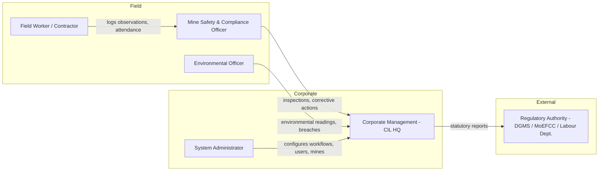
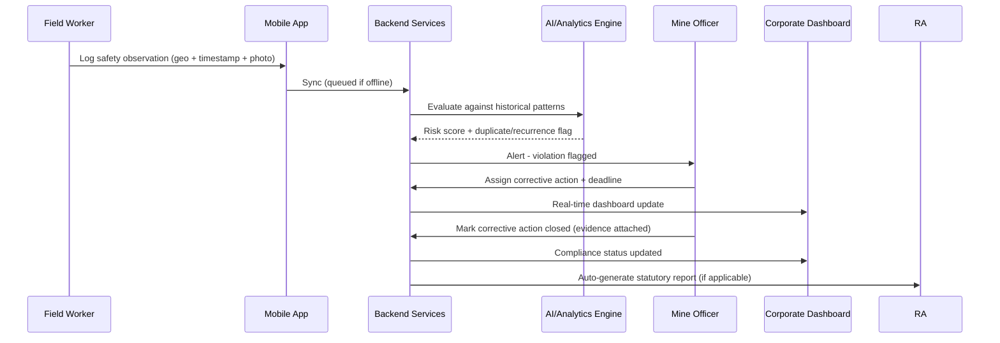
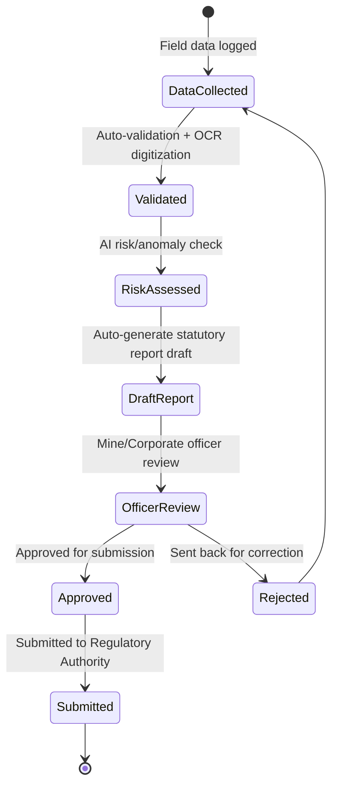
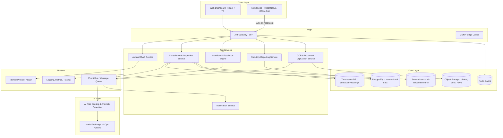
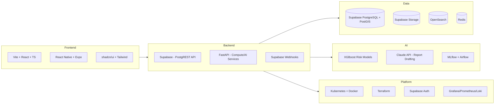
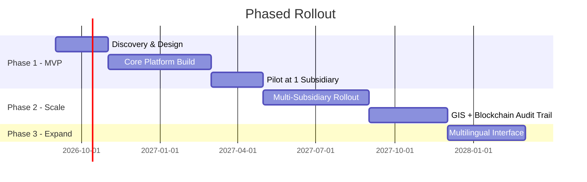

# Product Brief: AI-Based Smart Governance & Compliance Monitoring System for Coal Mines

|---|---|
|**Sponsor Organization**|Ministry of Coal|
|**Owning Department**|Coal India Limited (CIL)|
|**Category**|Software|
|**Theme**|Smart Automation|
|**Document Owner**|Product Management|
|**Status**|Draft v1.0|
|**Last Updated**|August 2026|

---

## 1. Executive Summary

Coal India Limited operates through multiple subsidiaries, mine sites, contractors, and regulatory touchpoints. Today, governance activities — statutory compliance, inspections, safety observations, production reporting, environmental monitoring, attendance, contractor management, and grievance handling — run on **fragmented spreadsheets, manual registers, and delayed paper trails**.

This document frames the product problem for a **centralized, AI-enabled Smart Governance and Compliance Monitoring Platform** that unifies these workflows into one digital ecosystem, spanning web dashboards, a geo-tagged mobile app, and an analytics/AI layer for risk detection and predictive alerts.

This brief is intentionally **scope-first**: it exists to pin down _what problem we are solving, for whom, and what "done" looks like_ before any design or engineering begins.

---

## 2. Problem Statement

> Mine-level governance data across CIL's subsidiaries is fragmented, manually recorded, and reported with delay — creating compliance blind spots, weak field accountability, and slow, low-visibility decision-making at corporate and regulatory levels.

### 2.1 Root Causes

### 2.2 Who Feels This Pain

|Stakeholder|Pain Today|
|---|---|
|Mine Safety/Compliance Officer|Manually logs inspections, chases paperwork, no real-time visibility into violations|
|Corporate Management (CIL HQ)|No consolidated, real-time view across subsidiaries; relies on periodic manual roll-ups|
|Regulatory Authorities (DGMS, MoEFCC, Labour Dept.)|Delayed, inconsistent statutory reporting; hard to audit|
|Contractors / Field Workers|Attendance, safety observations, and grievances tracked on paper, prone to loss/error|
|Environmental Officers|Manual environmental monitoring logs, delayed escalation of breaches|

---

## 3. Business Goals & Success Metrics

Ruthless focus: we are not building "a dashboard." We are building a system that **shrinks the time between a field event and a corrective/regulatory action**, and gives leadership a truthful, real-time picture of compliance risk.

|Business Goal|Metric|Target (Year 1 post-rollout)|
|---|---|---|
|Reduce compliance reporting delay|Avg. time from field observation → statutory report submission|↓ from days to < 24 hrs|
|Improve violation closure|Avg. time to close a flagged violation/corrective action|↓ by 50%|
|Increase field reporting coverage|% of inspections/observations geo-tagged & digitally logged|≥ 90% of scheduled inspections|
|Reduce manual paperwork|% of statutory forms generated automatically vs. manually|≥ 70% automated|
|Improve risk visibility|# of high-risk sites flagged proactively by AI before an incident/audit finding|Baseline established, trending up quarter-over-quarter|
|Scale across subsidiaries|# of mine sites / subsidiaries onboarded|Phase 1: 1 subsidiary pilot → Phase 2: all CIL subsidiaries|

### Non-Goals (Explicitly Out of Scope for v1)

- Replacing core ERP/finance systems of CIL subsidiaries.
- Full blockchain-based audit trail in Phase 1 (evaluated as Phase 2+ enhancement).
- Automated regulatory decision-making (system **flags and informs**; humans retain approval authority for statutory action).
- Multilingual conversational (chatbot) interface in Phase 1 — planned as a later enhancement, not an MVP dependency.

---

## 4. Users & Personas

|Persona|Primary Need|Primary Surface|
|---|---|---|
|Field Worker / Contractor|Log attendance, safety observations, incidents quickly, even offline|Mobile app|
|Mine Safety & Compliance Officer|Track inspections, violations, corrective actions per mine|Mobile + Web|
|Environmental Officer|Log & escalate environmental monitoring data|Mobile + Web|
|Corporate Management|Real-time, cross-subsidiary compliance & risk dashboard|Web dashboard|
|Regulatory Authority|Access verifiable, auditable statutory reports|Web portal (restricted view)|
|System Administrator|Configure mines, users, workflows, compliance rule sets|Web (admin console)|

---

## 5. Scope

### 5.1 In Scope (Phase 1 — MVP)

1. Statutory compliance tracking (safety, environment, production, labour).
2. Real-time inspection, observation, violation, and corrective-action logging.
3. Geo-tagged, time-stamped mobile field reporting with **offline-first support**.
4. Role-based dashboards (mine official / corporate / regulator view).
5. Automated alerts, reminders, and escalation workflows.
6. OCR-based digitization of existing paper compliance records.
7. AI/analytics layer: risk scoring, recurring-violation detection, anomaly flagging.

### 5.2 Phase 2+ (Explicitly Deferred)

- GIS-based spatial risk mapping overlays.
- Blockchain-anchored audit trail for tamper-evident statutory records.
- Multilingual conversational interface for field workers.
- Predictive maintenance / production-anomaly correlation models.

### 5.3 Scope Boundary Diagram

```mermaid
flowchart LR
    subgraph InScope [Phase 1 - In Scope]
        A1[Compliance Tracking]
        A2[Inspection & Violation Mgmt]
        A3[Mobile Field Reporting]
        A4[Dashboards - Mine/Corporate/Regulator]
        A5[Alerts & Escalation]
        A6[OCR Digitization]
        A7[AI Risk Scoring]
    end
    subgraph Deferred [Phase 2+ - Deferred]
        B1[GIS Spatial Mapping]
        B2[Blockchain Audit Trail]
        B3[Multilingual Chat Interface]
        B4[Predictive Production Models]
    end
    InScope -.evolves into.-> Deferred
```

---

## 6. Core User Journeys

### 6.1 Field Observation → Corrective Action → Closure

### 6.2 Statutory Reporting Workflow

---

## 7. Solution Alignment — How This Maps to Business Goals

|Capability|Business Goal Served|
|---|---|
|Geo-tagged offline mobile reporting|Increases field reporting coverage; reduces reporting delay|
|AI risk scoring & anomaly detection|Improves proactive risk visibility|
|Automated statutory report generation|Reduces manual paperwork; speeds up reporting|
|Escalation workflows|Reduces violation closure time|
|Centralized cross-subsidiary dashboard|Enables real-time, data-driven corporate decision-making|
|OCR digitization of legacy records|Enables historical trend analysis without a costly manual re-entry project|

---

## 8. High-Level System Architecture

The architecture favors a **modular, API-first, offline-tolerant** design, since field connectivity at mine sites is unreliable and the system must scale independently across subsidiaries.

---

## 9. Our Tech Stack

### 9.1 Frontend

| Layer                   | Technology                                        | Rationale                                                                             |
| ----------------------- | ------------------------------------------------- | ------------------------------------------------------------------------------------- |
| Web application         | **Vite + React + TypeScript + Framer Motions**    | Fast dev/build cycle, strong typing for a compliance-critical system, large ecosystem |
| UI component system     | **shadcn/ui + Radix Primitives + Tailwind CSS**   | Accessible, composable, themeable for multi-tenant subsidiary branding                |
| State/data layer        | **TanStack Query + Zustand**                      | Server-state caching + lightweight client state, avoids Redux boilerplate             |
| Forms & validation      | **React Hook Form + Zod**                         | Type-safe schema validation shared with backend contracts                             |
| Charts/dashboards       | **Recharts / Apache ECharts**                     | Compliance & risk visualizations, drill-down dashboards                               |
| Mobile application      | **React Native (New Architecture) + Expo**        | Single codebase for Android/iOS, matches web team's React/TS skillset                 |
| Mobile offline layer    | **WatermelonDB / SQLite + background sync queue** | Offline-first field data capture at low-connectivity mine sites                       |
| Maps/GIS (mobile & web) | **MapLibre GL JS**                                | Open-source, avoids vendor lock-in for GIS mapping needs                              |

### 9.2 Backend & Services

| Layer                      | Technology                                                                            | Rationale                                                                |
| -------------------------- | ------------------------------------------------------------------------------------- | ------------------------------------------------------------------------ |
| Core backend API & Auth    | **Supabase (PostgREST + GoTrue Auth)**                                                | Auto-generated CRUD APIs and authentication, zero backend boilerplate    |
| AI/ML & Compute services   | **Python (FastAPI)**                                                                  | Heavy lifting, background tasks (OCR), and AI anomaly detection          |
| Background tasks           | **FastAPI BackgroundTasks / Supabase Webhooks**                                       | Replaces heavy queues like Celery for hackathon simplicity               |
| OCR/document digitization  | **Unlimited OCR** | Digitizes legacy paper compliance records                                |

### 9.3 Data Layer

|Purpose|Technology|
|---|---|
|Transactional data|**Supabase PostgreSQL (with PostGIS extension for geo-queries)**|
|Search / audit trail search|**OpenSearch**|
|Caching|**Redis**|

### 9.4 AI / Analytics

|Purpose|Technology|
|---|---|
|Risk scoring & anomaly detection|**Python, scikit-learn / XGBoost** for tabular risk models|
|LLM-assisted report drafting & summarization|**Claude (Anthropic API)** for auto-drafting statutory report narratives from structured field data|
|MLOps / model lifecycle|**MLflow** for experiment tracking and model registry|
|Feature/data pipeline|**Apache Airflow** for scheduled ETL and model retraining pipelines|

### 9.5 Infrastructure & Platform

|Layer|Technology|
|---|---|
|Cloud (data-sovereignty compliant)|**MeghRaj (NIC GI Cloud) / empanelled Indian government cloud**, or on-prem NIC data centers|
|Containerization/orchestration|**Docker + Kubernetes**|
|CI/CD|**GitHub Actions / GitLab CI**|
|IaC|**Terraform**|
|API gateway|**Kong / NGINX Ingress**|
|Observability|**OpenTelemetry + Grafana + Prometheus + Loki**|
|Security scanning|**Trivy (container scanning), OWASP ZAP (DAST)**|

### 9.6 Tech Stack Overview (Visual)

---

## 10. Compliance, Security & Data Sovereignty Considerations

- All data residency must comply with Government of India data localization norms — infrastructure hosted on empanelled Indian cloud (MeghRaj) or NIC data centers.
- Role-Based Access Control (RBAC) enforced at API gateway and service layer; regulators get **read-only, scoped** access.
- End-to-end audit logging of every compliance record change (who/what/when), stored immutably in the audit search index — a precursor to the Phase 2 blockchain-anchored trail.
- PII of field workers (attendance, identity) encrypted at rest and in transit; access restricted by RBAC.

---

## 11. Rollout Strategy

---

## 12. Open Questions (For Alignment Before Design Starts)

1. Which single subsidiary is the best-fit Phase 1 pilot site (connectivity, leadership buy-in, existing digitization maturity)?
2. What is the authoritative source of truth for existing statutory compliance rule sets — is there a digitized rule repository, or does this need to be built from regulatory documents?
3. What are the actual field-connectivity conditions (offline duration, sync windows) we should design the mobile app's offline tolerance around?
4. Who owns final sign-off authority on AI-flagged risk scores before they reach a regulator-facing report?
5. What existing identity systems (if any) does Supabase Auth need to federate with across subsidiaries?

---

## 13. Appendix: Source Problem Statement Reference

This brief is derived from the Ministry of Coal / Coal India Limited problem statement: _"AI-Based Smart Governance and Compliance Monitoring System for Coal Mines"_ (Category: Software, Theme: Smart Automation).