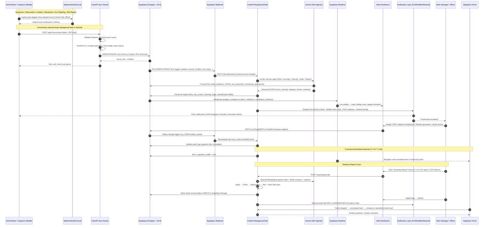
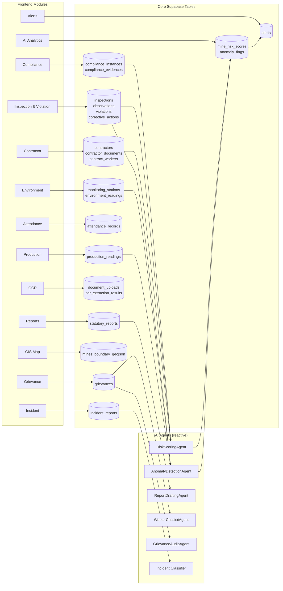
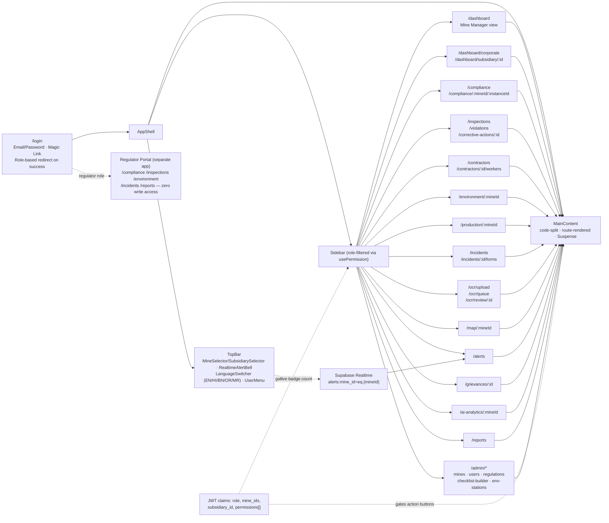
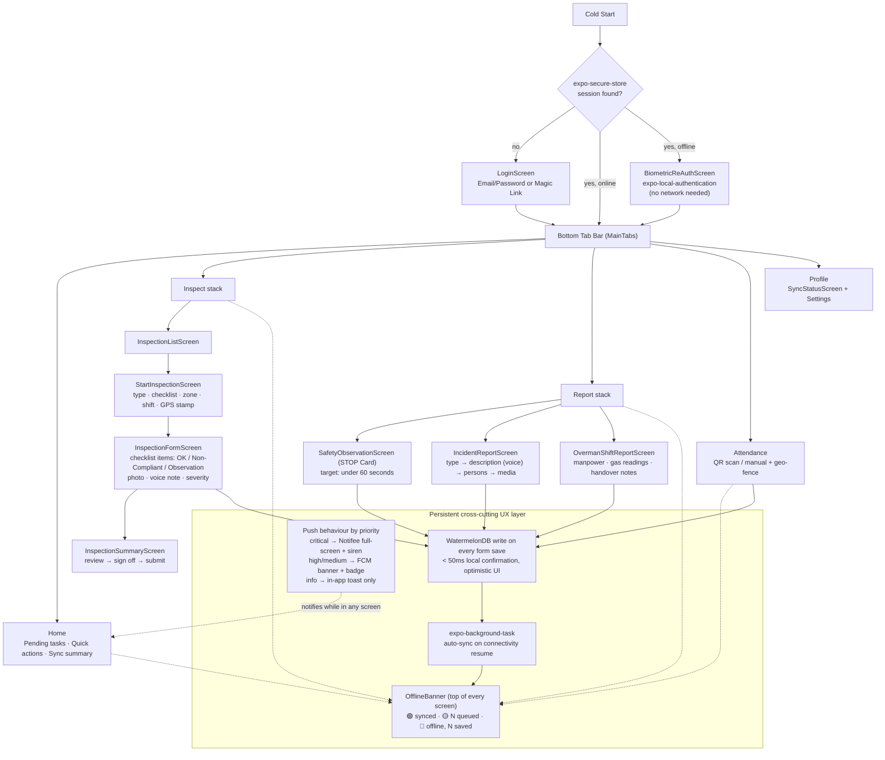
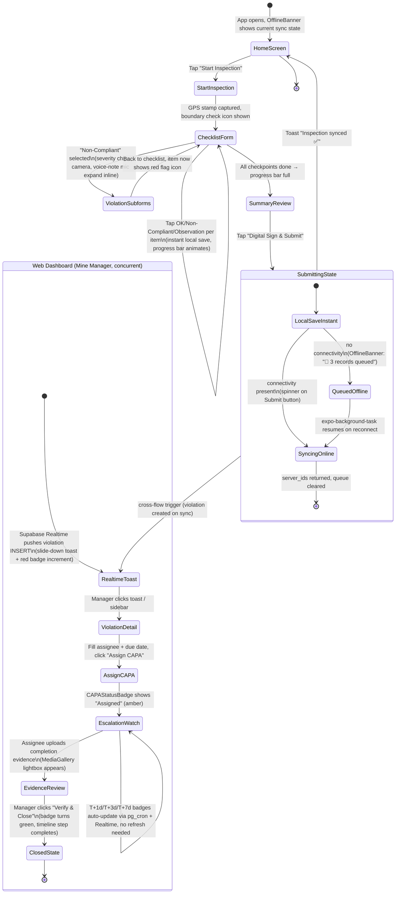

# COMET — All-in-One System & Workflow Diagram

**Platform:** Coal Operations Monitoring, Enforcement & Transparency (COMET)
**Purpose:** Single consolidated view of every client, service, data store, AI agent, and cross-module workflow, and how they connect end-to-end.
**References:** [TECH_STACK.md](TECH_STACK.md) · [backend_spec.md](backend_spec.md) · [frontend_spec.md](frontend_spec.md) · [workflows.md](workflows.md) · [PRD.md](PRD.md) · [Product Brief.md](Product%20Brief.md)

---

## 1. Master System & Data-Flow Diagram

This single diagram shows every client, the edge/gateway layer, Supabase (data/auth/realtime/storage/webhooks/cron), the FastAPI compute layer, every AI agent, every data store, and every notification channel — with the actual direction of data flow between them.

```mermaid
flowchart TB

%% ============ NODES (no category grouping) ============
WEB["Web Dashboard\nReact 19 + Vite + TanStack Router/Query\nMine Mgr · Subsidiary · Corporate · Admin"]
MOB["Mobile Field App\nReact Native + Expo + WatermelonDB\nInspector · Overman · Field Officer · Worker"]
REG["Regulator Portal\nRead-only Vite app\nDGMS · SPCB · Labour Dept"]
BOT["Multilingual Chatbot / Voice\nEmbedded in Web + Mobile"]

CDN["CDN\nCloudflare"]
WAF["WAF / DDoS Protection"]
GW["Supabase API Gateway\nJWT validation · rate limiting"]

AUTH["Supabase Auth (GoTrue)\nEmail/Password · Magic Link · PKCE · MFA\nissues JWT: role, mine_ids, subsidiary_id, permissions"]
PGREST["PostgREST\nDirect CRUD for simple reads/writes, RLS-scoped"]
RLS["Row-Level Security\nEvery table scoped by mine_id / subsidiary_id"]
REALTIME["Supabase Realtime\nWebSocket broadcast on table INSERT/UPDATE"]
STORAGE["Supabase Storage\nocr-uploads · inspection-media · compliance-evidence\nstatutory-reports · contractor-docs"]
WEBHOOKS["Supabase Webhooks\nPostgres triggers → HTTP POST to FastAPI"]
CRON["pg_cron\nScheduled jobs: escalation checks, risk scoring, cache refresh"]
PG[("PostgreSQL 15 + PostGIS\nAll domain tables, enums, indexes")]

AUTH --> RLS
PGREST --> RLS
RLS --> PG
WEBHOOKS -.reads/writes.-> PG
CRON -.triggers.-> PG
REALTIME -.subscribes.-> PG

ROUTERS["Domain Routers\ncompliance · inspection · contractor · environment\nproduction · incident · grievance · mine · user\nnotification · ocr · ai · report · sync · webhook"]
BGTASKS["Background Tasks\nEscalation ladders · SLA timers · PDF jobs · OCR jobs"]
SYNCENGINE["Mobile Sync Engine\n/sync/pull · /sync/push (WatermelonDB protocol)"]
GEOFENCE["PostGIS Geo-fence Validator\nST_Contains per synced record"]
OCRENGINE["Tesseract 5 OCR Pipeline\nimage preprocess → extract → confidence score"]
PDFGEN["WeasyPrint + Jinja2\nStatutory PDF rendering + SHA-256 hash"]
AUDITMW["Audit Middleware\nAppend-only audit_logs on every mutation"]

RISK["RiskScoringAgent\ngemini-1.5-pro\nTools: get_violations, get_capa_metrics,\nget_env_breaches, get_production_pressure,\nget_contractor_compliance, get_incident_history,\nget_grievance_backlog"]
ANOM["AnomalyDetectionAgent\ngemini-2.0-flash\nWeekly cluster/systemic-risk detection\n+ production/env anomaly checks"]
REPORTAI["ReportDraftingAgent\ngemini-1.5-pro\nDrafts statutory narrative sections + citations"]
CHATBOT["WorkerChatbotAgent\ngemini-2.0-flash\nTools: file_grievance, get_grievance_status,\nget_attendance, get_capa_status"]
AUDIOAGENT["GrievanceAudioAgent\ngemini-2.0-flash Audio\nTranscribe + translate + classify voice grievances"]
CLASSIFY["Incident Classifier\ngemini-2.0-flash\nSeverity + category suggestion on incident INSERT"]

REDIS[("Redis 7\nDashboard rollups, risk score cache")]
OPENSEARCH[("OpenSearch\nGrievance & violation full-text search")]

FCM["FCM Push\nexpo-notifications (standard)"]
NOTIFEE["Notifee\nEmergency alarms — DND bypass, siren, full-screen"]
RESEND["Resend API\nStatutory email + PDF delivery"]

DGMS_EXT["DGMS / SPCB / CCO / Labour Dept\nStatutory report recipients"]
NBG["National Blockchain for Governance\nSHA-256 hash anchoring (designed; prototype computes hash only)"]
BHUVAN["ISRO Bhuvan\nSatellite imagery overlay"]

%% ===== CLIENT -> EDGE -> SUPABASE/GATEWAY =====
WEB --> CDN --> WAF --> GW
MOB --> GW
REG --> GW
BOT --> GW
GW --> AUTH
GW --> PGREST
GW --> STORAGE
GW -->|"business logic calls\n/api/v1/*"| ROUTERS

%% ===== Mobile offline sync path =====
MOB <-->|"WatermelonDB local store\noffline-first read/write"| SYNCENGINE
SYNCENGINE --> GEOFENCE --> PG
SYNCENGINE --> AUDITMW

%% ===== Realtime push to web =====
REALTIME -->|"postgres_changes: alerts, violations,\ncompliance_instances"| WEB
REALTIME --> REG

%% ===== Webhooks trigger FastAPI =====
WEBHOOKS -->|"violation INSERT, compliance breach,\nenv breach, incident INSERT, ocr complete,\ndoc expiring, risk worsened"| ROUTERS
CRON -->|"escalation sweep every 15 min\nrisk recompute every 6h\nweekly cluster scan"| BGTASKS

%% ===== FastAPI internal wiring =====
ROUTERS --> BGTASKS
ROUTERS --> OCRENGINE
ROUTERS --> PDFGEN
ROUTERS --> AUDITMW
ROUTERS <--> PG
ROUTERS <--> REDIS
ROUTERS <--> OPENSEARCH
OCRENGINE --> STORAGE
PDFGEN --> STORAGE
BGTASKS --> RISK
BGTASKS --> ANOM
BGTASKS --> REPORTAI
BGTASKS --> CHATBOT
BGTASKS --> AUDIOAGENT
BGTASKS --> CLASSIFY

%% ===== AI agents call back into Postgres via tools =====
RISK -->|"FunctionTool queries"| PG
ANOM -->|"FunctionTool queries"| PG
REPORTAI -->|"FunctionTool queries"| PG
CHATBOT -->|"FunctionTool queries"| PG
RISK --> PG
ANOM --> PG
RISK -.writes.-> PG
ANOM -.writes.-> PG
CLASSIFY -.writes.-> PG
AUDIOAGENT -.writes.-> PG

%% ===== Notification dispatch =====
BGTASKS --> FCM
BGTASKS --> NOTIFEE
BGTASKS --> RESEND
FCM --> MOB
NOTIFEE --> MOB
RESEND --> DGMS_EXT

%% ===== Blockchain + GIS externals =====
PDFGEN -.SHA-256 anchor.-> NBG
ROUTERS -.satellite overlay.-> BHUVAN

%% ===== Regulator read-only =====
REG -->|"read-only, RLS-scoped\nno POST/PATCH/DELETE"| PGREST

classDef client fill:#1e293b,color:#fff,stroke:#0ea5e9;
classDef edge fill:#0f172a,color:#fff,stroke:#64748b;
classDef supabase fill:#064e3b,color:#fff,stroke:#10b981;
classDef fastapi fill:#78350f,color:#fff,stroke:#f59e0b;
classDef ai fill:#4c1d95,color:#fff,stroke:#a78bfa;
classDef data fill:#334155,color:#fff,stroke:#94a3b8;
classDef notify fill:#7f1d1d,color:#fff,stroke:#ef4444;
classDef ext fill:#1e3a8a,color:#fff,stroke:#60a5fa;

class WEB,MOB,REG,BOT client;
class CDN,WAF,GW edge;
class AUTH,PGREST,RLS,REALTIME,STORAGE,WEBHOOKS,CRON,PG supabase;
class ROUTERS,BGTASKS,SYNCENGINE,GEOFENCE,OCRENGINE,PDFGEN,AUDITMW fastapi;
class RISK,ANOM,REPORTAI,CHATBOT,AUDIOAGENT,CLASSIFY ai;
class REDIS,OPENSEARCH data;
class FCM,NOTIFEE,RESEND notify;
class DGMS_EXT,NBG,BHUVAN ext;
```

---

## 2. End-to-End Workflow Sequence (all 9 workflows combined)

This sequence diagram threads together the field-capture → AI → escalation → statutory-submission chain that every workflow in [workflows.md](workflows.md) follows, showing exactly which actor/service touches the data at each step.

---

## 3. Module-to-Table-to-Agent Traceability Map

Quick lookup of which module talks to which Supabase table(s) and which AI agent (if any) reacts to it — mirrors the router catalog in [backend_spec.md](backend_spec.md#3-service-catalog-fastapi-routers).

---

## 4. Web Dashboard — Navigation, Layout & Role-Gated UX Map

How the shell, routing, and role-based visibility actually wire together on the web — from [frontend_spec.md](frontend_spec.md#33-layout-shell) and [frontend_spec.md](frontend_spec.md#5-web-dashboard--all-pages--ux-flows). Every leaf route is a code-split, suspense-boundaried page rendered inside `MainContent`.

**UX conventions applied across every page:** skeleton loaders while parallel Supabase queries resolve → optimistic UI on mutations → toast + colour-flash on realtime insert → slide-over detail panels instead of full navigation for record drill-down → disabled buttons (not hidden) when `usePermission()` fails, with tooltip explaining the missing permission.

---

## 5. Web Dashboard — Module User Flows & Stakeholder Interactions

Exactly how each stakeholder actually moves through the web modules — which page they land on first, what they click, and what changes on screen as a result. Page IDs (R1–R15) match the route map in section 4. Derived from the per-page UX flows in [frontend_spec.md](frontend_spec.md#5-web-dashboard--all-pages--ux-flows).

```mermaid
flowchart TB
    subgraph MM["Mine Manager"]
        MM1["/dashboard (R1)\nSees Compliance/Violations/Contractor/Production KPI cards\n+ Compliance Calendar + Live Alerts feed"]
        MM1 -->|"clicks Violations KPI"| MM2["/violations (R4)\nSorted list, filter by severity"]
        MM2 -->|"opens a violation"| MM3["Violation Detail\nAssigns CAPA: officer + due date"]
        MM3 -->|"reviews evidence"| MM4["/compliance/:mineId/:instanceId (R3)\nApprove / Request Revision / Reject"]
        MM4 -->|"realtime push"| MM5["/alerts (R11)\nToast slides in on new critical alert"]
        MM5 -->|"month-end"| MM6["/reports (R14)\nAuto-populate → Digital Sign → Submit"]
    end

    subgraph SO["Safety Officer"]
        SO1["/inspections (R4)\nFilters mine/type/date/status"]
        SO1 -->|"opens inspection"| SO2["Inspection Detail\nReviews 3 violations / 7 OK / 2 observations"]
        SO2 -->|"flags high severity"| SO3["Assign CAPA panel\nsets assignee + T+7d default due date"]
        SO3 -->|"tracks progress"| SO4["/corrective-actions/:id\nVerify & Close once evidence uploaded"]
    end

    subgraph EO["Environmental Officer"]
        EO1["/environment/:mineId (R6)\nEC Conditions Tracker + MapLibre station pins"]
        EO1 -->|"adds manual reading"| EO2["Reading Form\nprescribed_limit compared instantly,\nstation pin flips red if threshold_breached"]
        EO2 -->|"AI panel updates"| EO3["AI Forecast Panel\nAcknowledges anomaly, creates investigation note"]
    end

    subgraph CM["Contractor Manager"]
        CM1["/contractors (R5)\nFilter by status / trust_score_range"]
        CM1 -->|"opens profile"| CM2["Contractor Profile\nUploads document → Supabase Storage → OCR"]
        CM2 -->|"reviews breakdown"| CM3["AI Trust Score panel\nSuspend / Blacklist button if risk_rating = HIGH"]
    end

    subgraph CO["Compliance Officer"]
        CO1["/compliance (R3)\nKanban: Pending / In Progress / Submitted / Approved"]
        CO1 -->|"low-confidence OCR"| CO2["/ocr/review/:itemId (R9)\nSide-by-side scan vs extracted fields, inline correction"]
        CO2 -->|"approves"| CO3["Instance status → approved\nAudit record + SHA-256 hash written"]
    end

    subgraph CE["Corporate Exec / Subsidiary Admin"]
        CE1["/dashboard/corporate (R2)\nMine risk heatmap + ranking + AI insight panel"]
        CE1 -->|"clicks underperforming mine"| CE2["/ai-analytics/:mineId (R13)\nContributing factors + category radar chart"]
        CE2 -->|"exports"| CE3["Download PDF compliance heatmap\n(shared with board / Ministry)"]
    end

    subgraph RG["Regulator (DGMS / SPCB)"]
        RG1["Regulator Portal /compliance\nRead-only, jurisdiction-scoped mine table"]
        RG1 -->|"audits trail"| RG2["/incidents\nForm 4-A/4-B records, view only"]
        RG2 -->|"checks authenticity"| RG3["/reports → Verify Integrity\nRecomputes SHA-256, compares to stored hash"]
    end

    subgraph SA["System Admin"]
        SA1["/admin/mines (R15)\nCreates mine, draws geo-fence polygon on map"]
        SA1 -->|"next"| SA2["/admin/users\nCreates user, assigns role_name_enum + mine scope"]
        SA2 -->|"next"| SA3["/admin/checklist-builder\nDrag-drop inspection checklist template items"]
    end

    subgraph GR["Grievance & Chatbot (any authenticated worker-facing widget)"]
        GR1["Chatbot widget (bottom-right, all pages)\nWorker types/asks in preferred language"]
        GR1 -->|"WorkerChatbotAgent responds"| GR2["Grievance status / new grievance filed\nconfirmation shown inline in chat"]
    end

    MM4 -.same instance, different actor.-> CO3
    SO3 -.same CAPA record.-> SO4
    CO2 -.same OCR item.-> CM2
```

**Per-stakeholder UX pattern (consistent across every module):**

| Stakeholder | First screen after login | Primary interaction | Resulting UI feedback |
|---|---|---|---|
| Mine Manager | `/dashboard` | Approve/reject compliance, assign CAPA, monitor alerts | KPI cards animate on change; realtime toast; gauge re-renders |
| Safety Officer | `/inspections` | Log observations → flag violations → assign CAPA | Severity chip colour-codes instantly; timeline step advances |
| Environmental Officer | `/environment/:mineId` | Enter readings, watch breach status | Station pin flips colour live; AI forecast panel updates |
| Contractor Manager | `/contractors` | Upload docs, monitor trust score | Trust badge recolors; expiry countdown gradient bar |
| Compliance Officer | `/compliance` | Review evidence, correct OCR, approve/reject | Kanban card moves column; audit hash shown on approve |
| Corporate Executive | `/dashboard/corporate` | Read-only oversight, drill into risk | Map pin colour + ranking table re-sort on new risk score |
| Regulator | Regulator Portal `/compliance` | Read-only audit, verify integrity | Green "Verified" checkmark animation / red mismatch banner |
| System Admin | `/admin/mines` | Configure mines, users, templates | Form wizard step indicator; success toast on save |
| Worker (chatbot) | Chat widget (any page) | File/check grievance in own language | Inline chat bubble response, no page navigation |

**Cross-cutting UX rule:** every stakeholder's action on one page is visible to every other relevant stakeholder within seconds via Supabase Realtime — a CAPA the Safety Officer assigns appears on the Mine Manager's `/dashboard` KPI card and the Corporate Executive's risk ranking without either of them refreshing.

---

## 6. Mobile Field App — Screen Flow & Interaction States

Mirrors [frontend_spec.md](frontend_spec.md#6-mobile-field-app--screens--flows) navigation tree, with the offline banner and sync state as a persistent cross-cutting UX layer rather than a separate screen.

**Critical UX exception path:** gas reading `CH4 > 1.5%` inside `InspectionFormScreen`/`OvermanShiftReportScreen` bypasses the normal save flow entirely — Notifee fires a full-screen, un-dismissable evacuation alert **on-device, offline-safe**, before the sync queue is ever touched.

---

## 7. Frontend State & Data-Binding Architecture (UI ⇄ Store ⇄ Backend)

How a UI component is actually wired to its data source, using the Compliance module as the representative example (identical pattern for every other feature folder per [frontend_spec.md](frontend_spec.md#2-monorepo--project-structure)).

```mermaid
flowchart LR
    COMP1["ComplianceInstanceCard.tsx\n(UI component)"]
    HOOK1["useComplianceInstances()\nTanStack Query hook"]
    SBCLIENT["supabase.from('compliance_instances')\n.select() — PostgREST"]
    PGDB[("Supabase Postgres\nRLS-scoped by mine_id")]

    COMP1 -->|"renders from"| HOOK1
    HOOK1 -->|"queryFn"| SBCLIENT
    SBCLIENT --> PGDB
    PGDB -->|"cached, stale-while-revalidate"| HOOK1 --> COMP1

    FORM1["SubmitEvidenceForm.tsx\nReact Hook Form"]
    ZOD["Zod schema\n(packages/shared-schemas)"]
    MUT1["useSubmitEvidence()\nTanStack mutation"]
    APIFETCH["apiFetch() → FastAPI\n/compliance/instances/:id/submit"]
    STORAGE2["Supabase Storage upload\n(evidence file)"]
    OCRJOB["FastAPI OCR BackgroundTask\n(Tesseract 5)"]

    FORM1 -->|"validates via"| ZOD --> MUT1 --> APIFETCH
    APIFETCH --> STORAGE2
    APIFETCH --> OCRJOB
    MUT1 -->|"onSuccess: invalidateQueries"| HOOK1

    RTHOOK["useRealtimeAlerts(mineId)\nSupabase Realtime channel"]
    ALERTSTORE["alertStore (Zustand)\nlive feed entries + unread count"]
    FEED["RealtimeAlertFeed.tsx / TopBar bell badge"]
    PGDB -.INSERT event.-> RTHOOK --> ALERTSTORE --> FEED

    AUTHSTORE["authStore (Zustand)\nsession, role, permissions, active mine_id"]
    PERMHOOK["usePermission(resource, action)"]
    APPROVEBTN["ApproveButton.tsx\nconditionally rendered/disabled"]
    AUTHSTORE --> PERMHOOK --> APPROVEBTN

    UISTORE["uiStore (Zustand)\nsidebar state, filters, modal state, selected mine"]
    MINESELECT["MineSelector.tsx (TopBar)"]
    MINESELECT --> UISTORE -->|"scopes all queries"| HOOK1

    classDef ui fill:#0c4a6e,color:#fff,stroke:#38bdf8;
    classDef store fill:#581c87,color:#fff,stroke:#c084fc;
    classDef net fill:#134e4a,color:#fff,stroke:#2dd4bf;
    class COMP1,FORM1,FEED,APPROVEBTN,MINESELECT ui;
    class HOOK1,MUT1,RTHOOK,ALERTSTORE,AUTHSTORE,PERMHOOK,UISTORE store;
    class SBCLIENT,PGDB,APIFETCH,STORAGE2,OCRJOB,ZOD net;
```

**Same pattern, mobile side:** `InspectionFormScreen` writes directly to a WatermelonDB `Model` (no TanStack mutation needed offline) → reactive WatermelonDB observers re-render the list instantly → `syncEngine.ts` pushes the diff to FastAPI only when connectivity allows, then TanStack Query is used solely for read-only online lookups (checklist templates, user directory).

---

## 8. Key UX Journey — Field Inspection to Resolved Violation (UI State Machine)

The literal sequence of screen/UI states a user sees, from the moment an inspector opens the app to the moment a Mine Manager sees the violation close — annotated with the UX affordance shown at each state.

**UX principle demonstrated:** the inspector's mobile flow and the manager's web flow are two independent state machines connected only by backend events (sync push → webhook → Realtime) — neither UI ever polls the other; every cross-flow update arrives as a push (toast, badge, banner) so both users always see current state without manual refresh.

---

## 9. Notes on Fidelity to Source Docs

- Architecture and service names match [backend_spec.md](backend_spec.md) sections 1–3 and [TECH_STACK.md](TECH_STACK.md).
- Sequence diagram consolidates the nine chains in [workflows.md](workflows.md) (compliance lifecycle, inspection→CAPA, contractor trust score, environment breach, production anomaly, attendance, grievance, statutory reports, AI risk scoring) into one representative path — each workflow differs only in which table/agent is touched, per the traceability map in section 3.
- Blockchain anchoring is drawn as a dotted/prototype-flagged link per the explicit prototype note in [backend_spec.md](backend_spec.md#162-blockchain-hash-anchoring) and [PRD.md](PRD.md#21-compliance--audit-trail-blockchain).
- SMS channel intentionally omitted from notifications per [frontend_spec.md](frontend_spec.md#513-alerts--notification-center) ("not used — emergency alerts handled by Notifee").
- Sections 4–8 (navigation map, web stakeholder flows, mobile screen flow, state/data-binding, UX journey state machine) are derived from [frontend_spec.md](frontend_spec.md) sections 3, 4, 5, 6, 7, 8, 9 — page routes, component names, hooks, and store names are taken verbatim from that spec.
