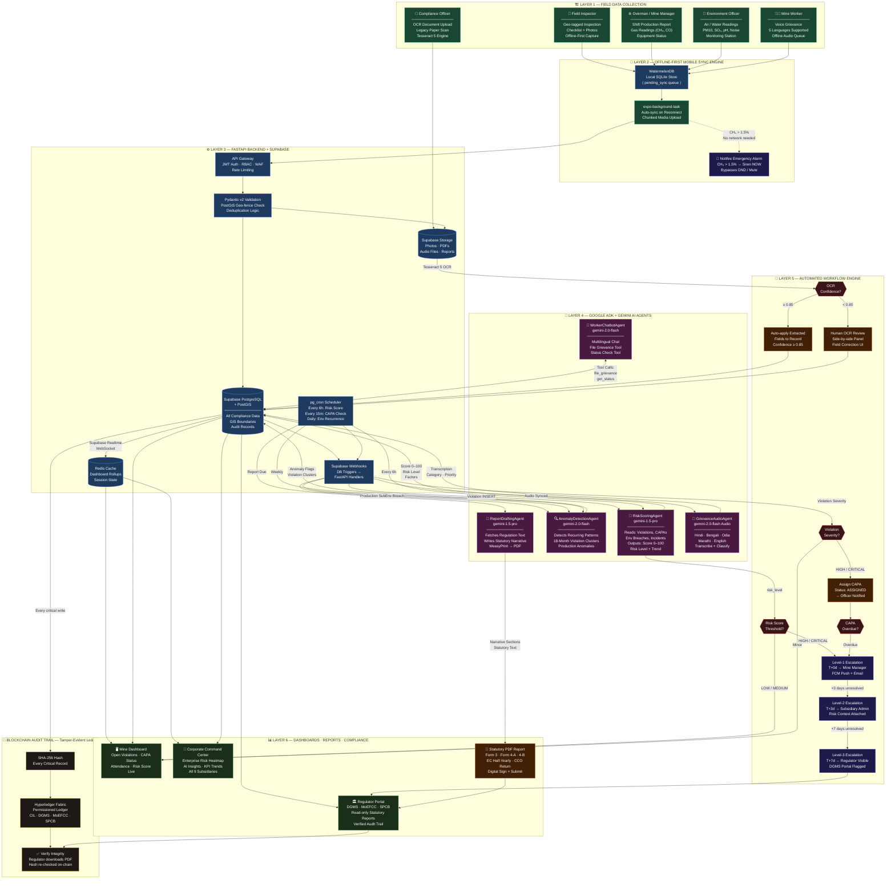

```mermaid
flowchart TD
    %% ─── STYLING ───────────────────────────────────────────────────────────
    classDef persona      fill:#1e3a5f,stroke:#4a9eff,color:#fff,rx:12
    classDef mobile       fill:#1a4731,stroke:#34d399,color:#fff
    classDef aiEngine     fill:#4a1942,stroke:#c084fc,color:#fff
    classDef data         fill:#1e3a5f,stroke:#60a5fa,color:#fff
    classDef action       fill:#422006,stroke:#fb923c,color:#fff
    classDef blockchain   fill:#1c1917,stroke:#facc15,color:#fff
    classDef regulator    fill:#1a2e1a,stroke:#86efac,color:#fff
    classDef decision     fill:#3b1515,stroke:#f87171,color:#fff,shape:diamond
    classDef notify       fill:#1e1b4b,stroke:#a5b4fc,color:#fff

    %% ═══════════════════════════════════════════════════════════════════════
    %% LAYER 0 — DATA COLLECTION (Field Sources)
    %% ═══════════════════════════════════════════════════════════════════════
    subgraph FIELD["🏗️  LAYER 1 — FIELD DATA COLLECTION"]
        direction TB
        P1["👷 Field Inspector\n────────────────\nGeo-tagged Inspection\nChecklist + Photos\nOffline-First Capture"]:::mobile
        P2["⚙️ Overman / Mine Manager\n────────────────\nShift Production Report\nGas Readings (CH₄, CO)\nEquipment Status"]:::mobile
        P3["🌿 Environment Officer\n────────────────\nAir / Water Readings\nPM10, SO₂, pH, Noise\nMonitoring Station"]:::mobile
        P4["👨‍🏭 Mine Worker\n────────────────\nVoice Grievance\n5 Languages Supported\nOffline Audio Queue"]:::mobile
        P5["📄 Compliance Officer\n────────────────\nOCR Document Upload\nLegacy Paper Scan\nTesseract 5 Engine"]:::mobile
    end

    %% ═══════════════════════════════════════════════════════════════════════
    %% LAYER 1 — OFFLINE-FIRST SYNC ENGINE
    %% ═══════════════════════════════════════════════════════════════════════
    subgraph SYNC["📱  LAYER 2 — OFFLINE-FIRST MOBILE SYNC ENGINE"]
        direction LR
        WDB["WatermelonDB\nLocal SQLite Store\n⟨ pending_sync queue ⟩"]:::data
        BG["expo-background-task\nAuto-sync on Reconnect\nChunked Media Upload"]:::mobile
        ALARM["🚨 Notifee Emergency Alarm\nCH₄ > 1.5% → Siren NOW\nBypasses DND / Mute"]:::notify
    end

    %% ═══════════════════════════════════════════════════════════════════════
    %% LAYER 2 — BACKEND PROCESSING
    %% ═══════════════════════════════════════════════════════════════════════
    subgraph BACKEND["⚙️  LAYER 3 — FASTAPI BACKEND + SUPABASE"]
        direction TB
        GW["API Gateway\nJWT Auth · RBAC · WAF\nRate Limiting"]:::data
        VALIDATE["Pydantic v2 Validation\nPostGIS Geo-fence Check\nDeduplication Logic"]:::data
        PG[("Supabase PostgreSQL\n+ PostGIS\n──────────────\nAll Compliance Data\nGIS Boundaries\nAudit Records")]:::data
        STORAGE[("Supabase Storage\nPhotos · PDFs\nAudio Files · Reports")]:::data
        REDIS[("Redis Cache\nDashboard Rollups\nSession State")]:::data
        WEBHOOKS["Supabase Webhooks\nDB Triggers →\nFastAPI Handlers"]:::data
        PGCRON["pg_cron Scheduler\nEvery 6h: Risk Score\nEvery 15m: CAPA Check\nDaily: Env Recurrence"]:::data
    end

    %% ═══════════════════════════════════════════════════════════════════════
    %% LAYER 3 — AI / GEMINI ADK
    %% ═══════════════════════════════════════════════════════════════════════
    subgraph AI["🤖  LAYER 4 — GOOGLE ADK  +  GEMINI AI AGENTS"]
        direction TB
        A1["🎯 RiskScoringAgent\ngemini-1.5-pro\n──────────────\nReads: Violations, CAPAs\nEnv Breaches, Incidents\nOutputs: Score 0–100\nRisk Level + Trend"]:::aiEngine
        A2["🔍 AnomalyDetectionAgent\ngemini-2.0-flash\n──────────────\nDetects Recurring Patterns\n18-Month Violation Clusters\nProduction Anomalies"]:::aiEngine
        A3["📝 ReportDraftingAgent\ngemini-1.5-pro\n──────────────\nFetches Regulation Text\nWrites Statutory Narrative\nWeasyPrint → PDF"]:::aiEngine
        A4["🎤 GrievanceAudioAgent\ngemini-2.0-flash Audio\n──────────────\nHindi · Bengali · Odia\nMarathi · English\nTranscribe + Classify"]:::aiEngine
        A5["💬 WorkerChatbotAgent\ngemini-2.0-flash\n──────────────\nMultilingual Chat\nFile Grievance Tool\nStatus Check Tool"]:::aiEngine
    end

    %% ═══════════════════════════════════════════════════════════════════════
    %% LAYER 4 — WORKFLOW DECISIONS
    %% ═══════════════════════════════════════════════════════════════════════
    subgraph WF["🔀  LAYER 5 — AUTOMATED WORKFLOW ENGINE"]
        direction TB
        D1{{"Violation\nSeverity?"}}:::decision
        D2{{"Risk Score\nThreshold?"}}:::decision
        D3{{"CAPA\nOverdue?"}}:::decision
        D4{{"OCR\nConfidence?"}}:::decision

        CAPA["Assign CAPA\nStatus: ASSIGNED\n→ Officer Notified"]:::action
        ESC1["Level-1 Escalation\nT+0d → Mine Manager\nFCM Push + Email"]:::notify
        ESC2["Level-2 Escalation\nT+3d → Subsidiary Admin\nRisk Context Attached"]:::notify
        ESC3["Level-3 Escalation\nT+7d → Regulator Visible\nDGMS Portal Flagged"]:::notify
        OCR_REVIEW["Human OCR Review\nSide-by-side Panel\nField Correction UI"]:::action
        AUTO_APPLY["Auto-apply Extracted\nFields to Record\nConfidence ≥ 0.85"]:::action
    end

    %% ═══════════════════════════════════════════════════════════════════════
    %% LAYER 5 — OUTPUTS
    %% ═══════════════════════════════════════════════════════════════════════
    subgraph OUTPUT["📊  LAYER 6 — DASHBOARDS · REPORTS · COMPLIANCE"]
        direction LR
        DASH_MINE["🖥️ Mine Dashboard\nOpen Violations · CAPA Status\nAttendance · Risk Score Live"]:::regulator
        DASH_CORP["🏢 Corporate Command Center\nEnterprise Risk Heatmap\nAI Insights · KPI Trends\nAll 9 Subsidiaries"]:::regulator
        DASH_REG["🏛️ Regulator Portal\nDGMS · MoEFCC · SPCB\nRead-only Statutory Reports\nVerified Audit Trail"]:::regulator
        PDF_REPORT["📄 Statutory PDF Report\nForm 3 · Form 4-A · 4-B\nEC Half-Yearly · CCO Return\nDigital Sign + Submit"]:::action
    end

    %% ═══════════════════════════════════════════════════════════════════════
    %% BLOCKCHAIN LAYER
    %% ═══════════════════════════════════════════════════════════════════════
    subgraph CHAIN["🔗  BLOCKCHAIN AUDIT TRAIL  —  Tamper-Evident Ledger"]
        direction LR
        HASH["SHA-256 Hash\nEvery Critical Record"]:::blockchain
        ANCHOR["Hyperledger Fabric\nPermissioned Ledger\nCIL · DGMS · MoEFCC · SPCB"]:::blockchain
        VERIFY["✅ Verify Integrity\nRegulator downloads PDF\nHash re-checked on-chain"]:::blockchain
    end

    %% ═══════════════════════════════════════════════════════════════════════
    %% CONNECTIONS
    %% ═══════════════════════════════════════════════════════════════════════

    %% Field → Sync
    P1 & P2 & P3 --> WDB
    P4 --> WDB
    P5 --> STORAGE

    %% Sync → Backend
    WDB --> BG --> GW
    BG -.->|"CH₄ > 1.5%\nNo network needed"| ALARM

    %% Backend processing
    GW --> VALIDATE --> PG
    VALIDATE --> STORAGE
    PG --> WEBHOOKS
    PGCRON --> WEBHOOKS

    %% Webhooks → AI
    WEBHOOKS -->|"Violation INSERT"| A1
    WEBHOOKS -->|"Production Submitted"| A2
    WEBHOOKS -->|"Env Breach"| A2
    WEBHOOKS -->|"Audio Synced"| A4
    PGCRON -->|"Every 6h"| A1
    PGCRON -->|"Weekly"| A2
    PGCRON -->|"Report Due"| A3

    %% AI → DB
    A1 -->|"Score 0–100\nRisk Level\nFactors"| PG
    A2 -->|"Anomaly Flags\nViolation Clusters"| PG
    A3 -->|"Narrative Sections\nStatutory Text"| PDF_REPORT
    A4 -->|"Transcription\nCategory · Priority"| PG
    A5 <-->|"Tool Calls:\nfile_grievance\nget_status"| PG

    %% OCR branch
    STORAGE -->|"Tesseract 5 OCR"| D4
    D4 -->|"≥ 0.85"| AUTO_APPLY
    D4 -->|"< 0.85"| OCR_REVIEW
    AUTO_APPLY & OCR_REVIEW --> PG

    %% Risk score → Decision
    A1 -->|"risk_level"| D2
    D2 -->|"HIGH / CRITICAL"| ESC1
    D2 -->|"LOW / MEDIUM"| DASH_MINE
    ESC1 -->|"+3 days unresolved"| ESC2
    ESC2 -->|"+7 days unresolved"| ESC3

    %% Violation workflow
    WEBHOOKS -->|"Violation Severity"| D1
    D1 -->|"HIGH / CRITICAL"| CAPA
    D1 -->|"Minor"| DASH_MINE
    CAPA --> D3
    D3 -->|"Overdue"| ESC1

    %% Cache + Realtime
    PG -->|"Supabase Realtime\nWebSocket"| REDIS
    REDIS --> DASH_MINE & DASH_CORP

    %% Outputs
    PG --> DASH_MINE & DASH_CORP & DASH_REG
    ESC3 --> DASH_REG
    PDF_REPORT --> DASH_REG

    %% Blockchain
    PG -->|"Every critical write"| HASH
    HASH --> ANCHOR
    ANCHOR --> VERIFY
    DASH_REG --> VERIFY
```